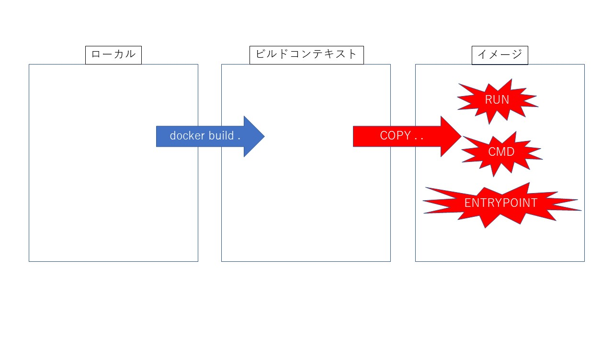
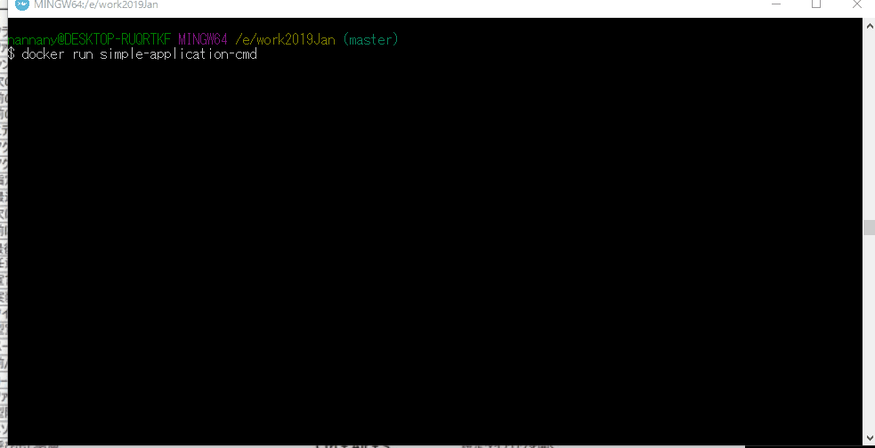

# やること

Dockerについて理解するために、非常に簡易なアプリケーションを動かしてみる。  
具体的には、"Hello world!" を1秒に1回出すようなアプリケーションをDockerを使って動かしてみる。
ビルド〜実行まですべてコンテナ上で行うことを目指す。
  
Javaのソースコードは以下のよう。
https://github.com/nannany/very-simple-application

# 環境

Windows10 HOME 上で実行した。  
Windows上にDockerの動作環境を作成するにあたっては、Docker Toolboxを使用した。  
詳細は以下の記事参照。
https://qiita.com/idani/items/fb7681d79eeb48c05144

# dockerイメージを作る流れ

dockerイメージ作成のざっくりとした流れは以下のような感じ。



# 実行するdockerコマンド

イメージを作成する際に実行するdockerコマンドは、

```
docker build -t simple-application -f Dockerfile.cmd .
```

`-t simple-application` にて、イメージの名称をsimple-applicationにしている。  
`-f Dockerfile.cmd` にて、イメージの作成に際して使用するDockerfileを、上記のコマンドを実行しているパスにあるDockerfile.cmdとしている。（デフォルトは、コマンドを実行しているパスにあるDockerfileが選択される）  
最後の`.`で、コマンドを実行しているパス配下を、ビルドコンテキストに追加している。

# Dockerfile.cmd

まずはベースイメージを選ぶために、`FROM`を記述する。  
ここでは、適当に`ubuntu:disco`を選択する。  
 
次に、ビルドコンテキストからイメージにファイルをコピーするために、`COPY . .`と記述する。  
 
その次に、ソースのビルド、Javaの実行に必要なパッケージ（mavenとopenjdk）をインストールし、mavenのjar作成コマンドを実行する。

```
RUN apt-get update && apt-get install -y \
    maven \
    openjdk-8-jre \
 && cd simple \
 && mvn package
```

書き方は下記をまねて、レイヤの数の最小化、apt-get updateとinstallを同時にやることを意識した。
http://docs.docker.jp/engine/articles/dockerfile_best-practice.html

# 動かす

上記で作成したイメージを、以下のコマンドで動作させてみる。
```
docker run simple-application-cmd
```

以下のように表示され、うまくいった。




