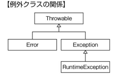

# Java Silver
Java SE 8 Programmer I を受けるにあたって得た知識を残す。
勉強に使用した本は「徹底攻略Java SE 8 Silver問題集［1Z0-808］対応」
https://www.amazon.co.jp/dp/B01ASGJYIE/ref=dp-kindle-redirect?_encoding=UTF8&btkr=1
であったので、それに沿った構成で書いていく。

# 1. Javaの基本
* クラスは必ず何らかのパッケージに属する。パッケージ宣言をしていない場合は、「無名パッケージ」なるものに属することとなる。
* java.lang パッケージのインポート宣言は省略することができる。
* staticインポートなるものがある。本来staticなフィールド、メソッドは、`クラス名.フィールド`や`クラス名.メソッド`で呼び出す。staticインポートを行えば、クラス内で定義されたフィールド、メソッドかのように扱うことができる。
**これを実際の開発でつかうことってあるのだろうか??**
書き方の注意としては、`static import`ではなく、`import static`の順。

```
package tryAny;

public class staticImport {
    public static int num = 0;

    public static void print() {
	System.out.println(num);
    }
}
```

```
package tryAny.test;

import static tryAny.staticImport.*;

public class Main {
    public static void main(String[] args) {
	num = 13;
	print();
    }
}
```
* 同名のフィールド、メソッドが存在した場合、そのインポートは無視される。

# 2. Javaのデータ型の操作
* 数値を2進数、8進数、16進数のリテラルで表す場合、それぞれ先頭、0b、0、0xで始める。
* 整数リテラル表記`_` についての注意点は以下。
 * リテラルの先頭と末尾には記述できない
 * 記号の前後には記述できない**8進の先頭の`0` は記号にならないらしい。。**
 * プリミティブ型の変数に`null`は代入できない。`null`は、変数が何も参照しないことを表すデータであるため。
 * 識別子(メソッド、クラスなどを一意に識別するためのもの)に使える記号は、`_`と`通貨記号`。また、識別子の先頭は数字にしてはいけない。

# 3. 演算子と判定構造の使用
* 大きな範囲の値を小さな変数に代入するときは明示的なキャストが必要。
 * byte:8bit：-128~127
 * char:16bit：0~65535
 * short:16bit:-32768~32767
 * int:32bit:-2147483648~2147483647
 * long:64bit:-9223372036854775808~9223372036854775807
* 桁あふれを以下で試した。

```
package tryAny;

import java.nio.ByteBuffer;

public class Cast {
    public static void main(String[] args) {
	// short桁あふれ
	long a = 32768;
	int b = (int) a;
	short c = (short) b;
	byte[] byteShort = ByteBuffer.allocate(2).putShort(c).array();
	System.out.println("shortの桁あふれ");
	for (byte b1 : byteShort) {
	    System.out.printf("%x ", b1);
	}
	System.out.println();
	System.out.println("32768の時のint　" + b);
	System.out.println("32768の時のshort　" + c);

	// int桁あふれ
	long aa = 2147483648L;
	int bb = (int) aa;
	short cc = (short) bb;
	byte[] byteInt = ByteBuffer.allocate(4).putInt(bb).array();
	System.out.println("int,shortの桁あふれ");
	for (byte b2 : byteInt) {
	    System.out.printf("%x ", b2);
	}
	System.out.println();
	System.out.println("2147483648の時のint　" + bb);
	System.out.println("2147483648の時のshort　" + cc);
    }
}
```

標準出力
```
shortの桁あふれ
80 0 
32768の時のint　32768
32768の時のshort　-32768
int,shortの桁あふれ
80 0 0 0 
2147483648の時のint　-2147483648
2147483648の時のshort　0
```

* `int a = 1+1L;`のように、intで表現できる範囲を超えてなくても、`int a = 1+(int)1L;`とキャストが必要。
* 関係演算子`<` `<=` `>` `>=` は数値以外の比較はできない。`true<false` とかできそうだけどできない。
* switch文の条件式に戻せる値は、
 * int型以下の整数型とそのラッパークラス
 * 文字と文字列
 * 列挙型
* switch文のcase値の条件は、
 * 条件式が戻す値と同じ型か互換性のある型であること
 * 定数または、コンパイル時に値を決めることができること(つまりfinalついてい)
 * nullでないこと
* コンスタントプールなる領域がメモリにあり、`String a = "const";` のようにaが宣言された場合、文字列リテラル"const"はコンスタントプールに保持される。次に`String b = "const";`のようなコードがあった場合には、コンスタントプールを走査し、"const"が存在しているので、そのメモリ番地を、bは保持することになる。

```
package tryAny;

public class ConstantPool {
    public static void main(String[] args) {
	String a1 = "constpool1";
	String b1 = "constpool1";
	System.out.println(a1 == b1);

	String a2 = new String("constpool2");
	String b2 = "constpool2";
	System.out.println(a2 == b2);
    }
}
```
https://qiita.com/liguofeng29/items/16d6dbec471bc5269f0e
は分かりやすかった。


おいおいこの辺も読んでみたい(が、難しそう)。
https://dev.classmethod.jp/server-side/java/classfile-reading/

* 中括弧({}のこと)を使わないif文についての問題もあったが、これは問う意味あるのか？

# 4. 配列の作成と使用
* 配列の初期化方法について、以下のパターンはコンパイルエラーになる。**IDEが教えてくれることをわざわざ細かく覚えるひつようがあるだろうか。**
 * 配列の要素数を指定し、かつ、初期化演算子{}を用いるとコンパイルエラーになる。
```
int[] array = new int[2]{ 2, 3}; // コンパイルエラー
```
 * 多次元配列の変数の次元数と参照先の次元数が不一致だとコンパイルエラーになる。
```
int[][] array = new int[]{}; // コンパイルエラー
```
 * 変数宣言時以外で初期化演算子を使用するとコンパイルエラーになる。
```
int[] d;
d = {2,3}; // コンパイルエラー
```

# 5.ループ構造の使用
* for文の初期化文は複数変数宣言できるが、同じ型でないといけない。
* for文の条件文は複数記述できない。

```
package tryAny;

public class For {
    public static void main(String[] args) {
	// 初期化文複数
	for (int i = 0, j = 1; i < j; i++) {
	    System.out.println(i);
	}
	
	// 更新文複数
	for (int i = 0; i < 4; i++, tmp(), tmp2()) {
	    System.out.println(i);
	}
    }

    private static void tmp() {
	System.out.println("tmp");
    }

    private static void tmp2() {
	System.out.println("tmp2");
    }
}
```

* ラベルは以下につけられる。(**コードブロックとループ分岐以外どうやって使うのか検討がつかない。。。**)
 * コードブロック
 * ループ、分岐
 * 式
 * 代入
 * return文
 * tryブロック
 * throw文

# ６．メソッドのカプセル化の操作
* static なメソッドは、staticで修飾されたものしかアクセスできない。なぜなら、staticでないものは、その時点でヒープ領域に存在していない可能性があるから。
* オーバーロードの条件となるのは、引数の違いだけで、**戻り値、アクセス修飾子の違いは関係ない**。

```
package tryAny;

public class Overload {
    public static void main(String[] args) {
	System.out.println(ret(1, 2)); // 3
	System.out.println(ret(1.0, 2));// 0
	System.out.println(ret(1, 2.0));// 2

    }

    private static String ret(int a, int b) {
	return Integer.toString(a + b);
    }

    public static int ret(int a, double b) {
	return a * (int) b;
    }

    protected static int ret(double a, int b) {
	return (int) a / b;
    }
}
```

* コンストラクタにおける処理の前に実行する命令を、**初期化ブロック**に書くことができる。

```
package tryAny;

public class InitializeBlock {
    public static void main(String[] args) {
	InitTest i1 = new InitTest(); // JavaSilver
	InitTest i2 = new InitTest(" is dead");// JavaSilver is dead
	InitTest i3 = new InitTest(100, new String[] { "dummy", "point" });// JavaSilver100point
    }

}

class InitTest {
    {
	System.out.print("JavaSilver");
    }

    InitTest() {
	System.out.println();
    }

    InitTest(String str) {
	System.out.println(str);
    }

    InitTest(int a, String... str) {
	System.out.println(a + str[1]);
    }
}
```

* コンストラクタ内で、thisを用いてオーバーロードされた別のコンストラクタを呼び出す場合には**最初に記述しなければならない**。

* アクセス修飾子の説明は以下。protected,なし,あたりは忘れがち。
| 修飾子 | 説明 |
| -- | -- |
| public | 全てのクラスからアクセス可能 |
| protected | 同じパッケージに属するか、継承しているサブクラスからのみアクセス可能 |
| なし | 同じパッケージに属するクラスのみからアクセス可能 |
| private | クラス内のみからアクセス可能 |

# 7.継承の操作
* インターフェースで規定するメソッドはすべてpublicと解釈される。
* オーバーライドに関して、戻り値は元と同じか、そのサブクラスであればよい(共辺戻り値)。

```
package tryAny;

public class Extends {
    public static void main(String[] args) {
	Tmp tmp = new Tmp2();
	System.out.println(tmp.ret(1));
    }
}

abstract class Tmp {
    abstract Object ret(int i);
}

class Tmp2 extends Tmp {
    @Override
    Integer ret(int i) {
	return i;
    }

}
```

* インスタンスが持つメソッドが呼び出されたときに、どれが使われるかを定義した表を**メソッドディスパッチテーブル**という。これは、インスタンスの生成時に作られ、JVMが管理する。
* オーバーライドしたメソッドはアクセス制御を緩くすることはできるが、厳しくすることはできない。
* スーパークラスの変数を明示的にダウンキャストすれば、実態のインスタンスがどうあれ、コンパイルは通すことができる。

```
package tryAny;

public class Cast2 {
    public static void main(String[] args) {
	A a = new A();
	B b = (B) a; // コンパイルは通るが、実行時ClassCastException発生
    }

}

class A {

}

class B extends A {

}
```

# 8.例外の処理
* catch節、finally節の双方にreturn文があった場合、finallyのほうが優先される。

```
package tryAny;

public class Exception {
    public static void main(String[] args) {
	int ret = test();
	System.out.println(ret); // 20
    }

    private static int test() {
	try {
	    int[] tmp = {};
	    int a = tmp[0];
	} catch (RuntimeException e) {
	    return 10;
	} finally {
	    return 20;
	}
    }

}
```

* 例外クラスの関係は以下のよう。


* staticイニシャライザ内で例外が発生したら、 ExceptionInitializerErrorをJVMが発生させる。


# 9.Java APIの主要なクラスの操作
