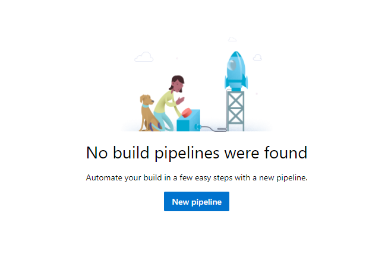
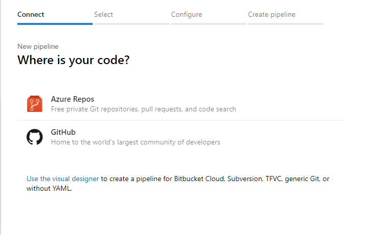
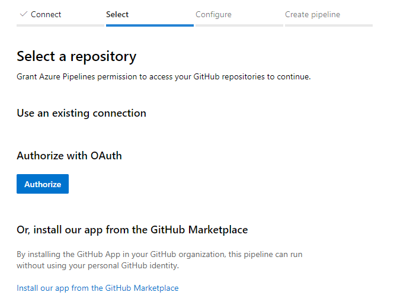
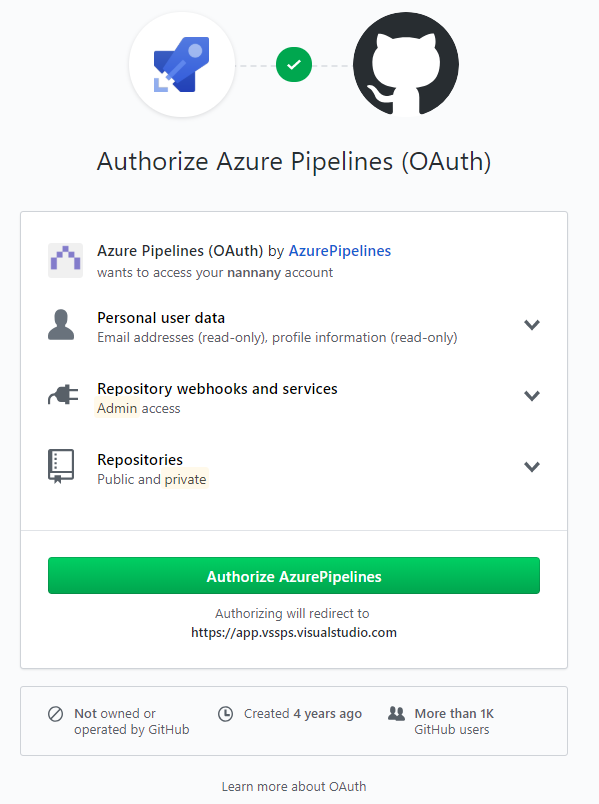
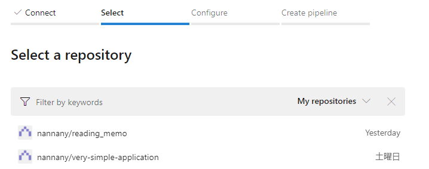
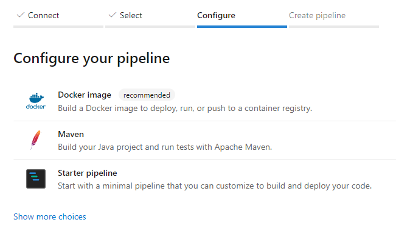
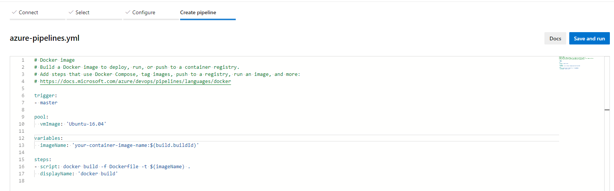
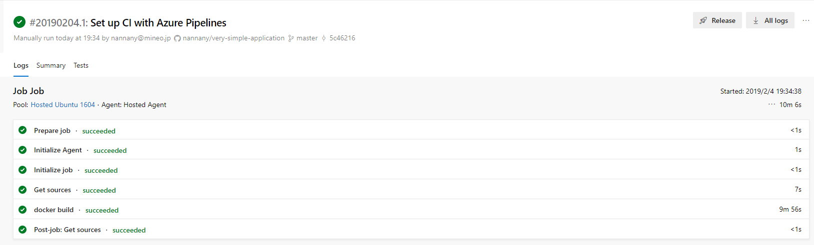
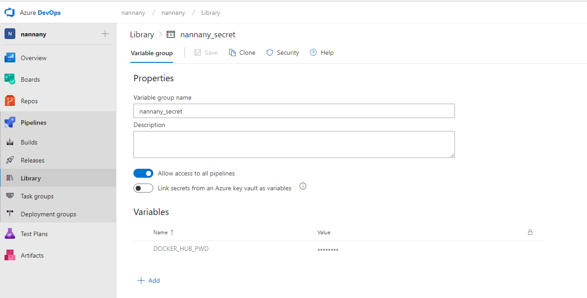
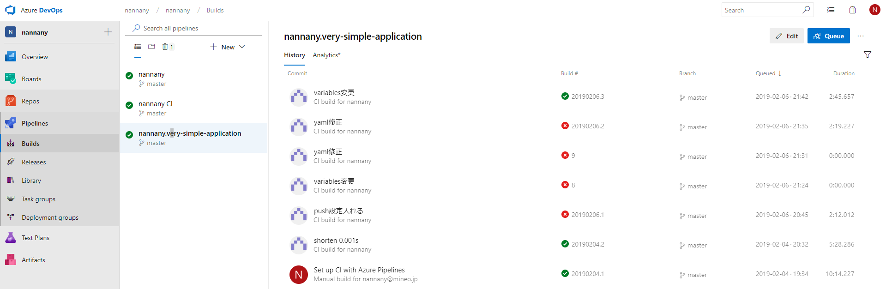

# Azure CLIのインストール

下記のページの「MSIインストーラのダウンロード」からmsiをダウンロードして、実行。
https://docs.microsoft.com/ja-jp/cli/azure/install-azure-cli-windows?view=azure-cli-latest

`az login`コマンドを実行するとブラウザが立ち上がるので、自分のアカウントでログインする。

# やること

GitHub上にあるソースコードを、Azure DevOpsのPipelinesでCIをまわす。  

GitHubへのpushをトリガーとして、CIが回り始め、ジョブの中でソースのビルドを実行し、Dockerイメージを作成し、作成したイメージをDocker HubにPUSHする。

# 前提

Azureにアカウントを作っている。

# pipelineを作る手順

まず、Azure DevOpsにログインし、以下の画面に遷移して、pipelineを押下。


以下のような画面がでたら、New pipelineを押下。



以下の画面で、GitHubを押下。



以下の画面で、Authorizeを押下。



以下の画面で、Authorize AzurePipelinesを押下。



以下の画面で、GitHubのパスワードを入力。


以下のような画面から、連携したいリポジトリを選択。



以下の画面で、Docker imageを選択。



デフォルトで以下のようなYAMLの生成が促されるので、Save and run押下。



Save and run押下。


ジョブが走る。成功したら以下のような画面になる。



以上の手順を実行すると、連携したGitHubリポジトリ上にazure-pipelines.ymlが生成される。
デフォルトだと以下のようなazure-pipelines.ymlが生成される。

```
# Docker image
# Build a Docker image to deploy, run, or push to a container registry.
# Add steps that use Docker Compose, tag images, push to a registry, run an image, and more:
# https://docs.microsoft.com/azure/devops/pipelines/languages/docker

trigger:
- master

pool:
  vmImage: 'Ubuntu-16.04'

variables:
  imageName: 'your-container-image-name:$(build.buildId)'

steps:
- script: docker build -f Dockerfile -t $(imageName) .
  displayName: 'docker build'
```

---

```
trigger:
- master
```
の部分で、masterへの変更が生じた際にジョブが流れますよ、と言っている。

```
pool:
  vmImage: 'Ubuntu-16.04'
```
の部分で、Azureのクラウド上でジョブを実行する際に使用するOSイメージを選択できる。

```
variables:
  imageName: 'your-container-image-name:$(build.buildId)'
```
の部分で、imageNameという変数に、your-container-image-name:$(build.buildId)を入れている。
build.buildIdはAzure DevOps側で事前に定義されている値。

事前定義されている値は以下参照。
https://docs.microsoft.com/en-us/azure/devops/pipelines/build/variables?view=azure-devops

```
steps:
- script: docker build -f Dockerfile -t $(imageName) .
  displayName: 'docker build'
```
の部分で、ここでは`docker build -f Dockerfile -t $(imageName) .`というコマンドを流しますよ、このジョブはコンソールやログに`docker build`という名前で表示させますよ、と言っている。

# azure-pipelines.ymlを編集

現状だと、作成されたイメージのDocker HubへのPUSHはないので、azure-pipelines.ymlを編集する。
下記資料のPush an imageの部分を参考にして、以下のように変更する。

https://docs.microsoft.com/en-us/azure/devops/pipelines/languages/docker?view=azure-devops&tabs=yaml#push-an-image

```
# Docker image
# Build a Docker image to deploy, run, or push to a container registry.
# Add steps that use Docker Compose, tag images, push to a registry, run an image, and more:
# https://docs.microsoft.com/azure/devops/pipelines/languages/docker

trigger:
- master

pool:
  vmImage: 'Ubuntu-16.04'

variables:
- group: nannany_secret
- name: imageName
  value: 'simple-application-azure:$(build.buildId)'

steps:
- script: |
    docker build -f Dockerfile.maven -t nannany/$(imageName) .
    docker login -u nannany -p $(DOCKER_HUB_PWD)
    docker push nannany/$(imageName)
  displayName: 'docker build'
```

Docker Hubのパスワードはそのまま記述せずに、PipelinesのLibrary機能を用いて変数に格納された値を使用している。




# 結果確認

設定した通り、masterブランチに変更が入るたびにパイプラインが流れる。
結果の確認は、PipelinesのBuildsからみることができる。



また、Docker Hubにも登録されていることが確認できた。


