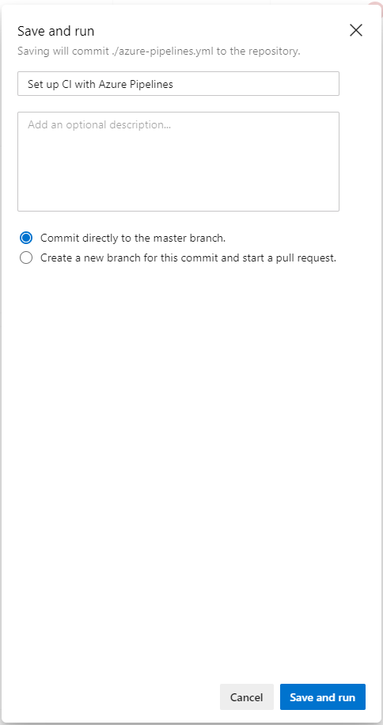

# Azure CLIのインストール

下記のページの「MSIインストーラのダウンロード」からmsiをダウンロードして、実行。
https://docs.microsoft.com/ja-jp/cli/azure/install-azure-cli-windows?view=azure-cli-latest

`az login`コマンドを実行するとブラウザが立ち上がるので、自分のアカウントでログインする。

# やること

GitHub上にあるソースコードを、Azure DevOpsのPipelinesでCIをまわす。  

GitHubへのpushをトリガーとして、CIが回り始め、ジョブの中でソースのビルドを実行し、Dockerイメージを作成し、作成したイメージをDocker HubにPUSHする。

# 前提

Azureにアカウントを作っている。

# pipelineを作る手順

まず、Azure DevOpsにログインし、以下の画面に遷移して、pipelineを押下。


以下のような画面がでたら、New pipelineを押下。


以下の画面で、GitHubを押下。


以下の画面で、Authorizeを押下。


以下の画面で、Authorize AzurePipelinesを押下。


以下の画面で、GitHubのパスワードを入力。


以下のような画面から、連携したいリポジトリを選択。


以下の画面で、Docker imageを選択。


デフォルトで以下のようなYAMLの生成が促されるので、Save and run押下。


Save and run押下。



ジョブが走る。成功したら以下のような画面になる。


以上の手順を実行すると、連携したGitHubリポジトリ上にazure-pipelines.ymlが生成される。
デフォルトだと以下のようなazure-pipelines.ymlが生成される。

```
# Docker image
# Build a Docker image to deploy, run, or push to a container registry.
# Add steps that use Docker Compose, tag images, push to a registry, run an image, and more:
# https://docs.microsoft.com/azure/devops/pipelines/languages/docker

trigger:
- master

pool:
  vmImage: 'Ubuntu-16.04'

variables:
  imageName: 'your-container-image-name:$(build.buildId)'

steps:
- script: docker build -f Dockerfile -t $(imageName) .
  displayName: 'docker build'
```

```
trigger:
- master
```
の部分で、masterへの変更が生じた際にジョブが流れますよ、と言っている。

```
pool:
  vmImage: 'Ubuntu-16.04'
```
の部分で、Azureのクラウド上でジョブを実行する際に使用するOSイメージを選択できる。

```
variables:
  imageName: 'your-container-image-name:$(build.buildId)'
```
の部分で、

# azure-pipelines.ymlを編集

現状だと、作成されたイメージのDocker HubへのPUSHはないので、azure-pipelines.ymlを編集する。


