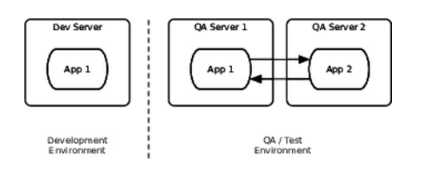
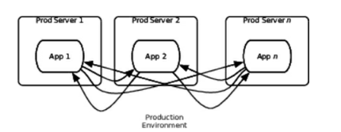
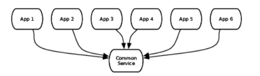
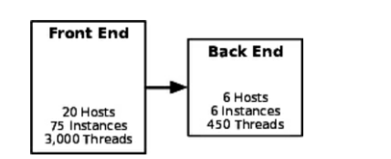
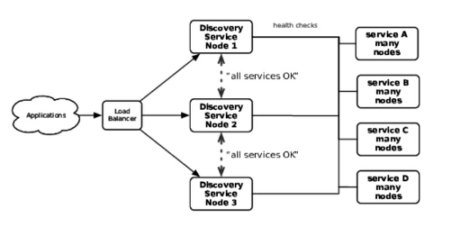
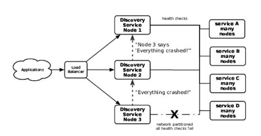
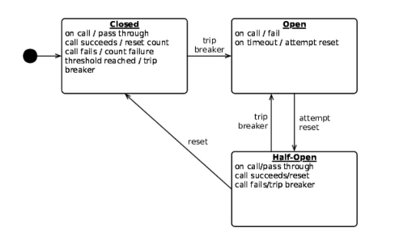

# 序文
この本では、さまざまな現実に向き合ったソフトウェアのアーキテクチャ、デザイン、作り方についてみていく。

## 対象読者
アーキテクト、デザイナー、開発者。

## この本の構成
4つのパートに分かれており、各パートはケーススタディから始まる。
4つのパートとは、

* 安定性について
* 本番環境の設計について
* デプロイについて
* 運用しやすいシステムの構築について

である。

## ケーススタディについて
具体的な社名等は伏せているが、実際に筆者が経験したことについて書いている。

# 1章 本番環境で稼働する
仕様を実装し、直ちに本番環境にデプロイできるわけではない。
また、テストを通したとしても想定外のことが必ず起きる。

## 正しく標準を合わせよ
ローコストで高品質なものを作るべき。？？

## チャレンジのスコープ
ソフトウェアを早く、安く作ったり、操作しやすさを求めたり、などチャレンジすることが多くなるほどアーキテクチャや設計は継続的に改善する必要が出てくる。

## 百万ドルがあちこちに
開発時の工数のみを気にして、運用のことをないがしろにするのはナンセンス。なぜなら、開発は1度きりだが、運用は以後ずっと続くからだ。
本書では、技術的な視点と経営的な視点が大事なものとなってくる。

## フォースを使え
設計によって、その他に与える影響は大きく異なる。本書ではその例を見せていく。

## 現実的なアーキテクチャ
抽象に逃げず、現実を見て設計すべし。

## 要するに
本書では最初のリリースから、それ以降のシステムの拡張について扱う。

# パート1 安定性を作る

# 2章 ケーススタディ：エアラインを止めた例外
小さなエラーが雪だるま式に膨れ上がり、航空会社に大損失を与えた例をあげる。

エラーの発端はcore facilities（CF）に関わるデータベースの計画フェイルオーバーだった。
エラーが発生したとき、この航空会社はSOAへの移行過渡期であり、CFは第一世代のものであった。
構成としては以下の図のようで、単一障害点のない高可用性アーキテクチャであった。


## 窓を変える
計画フェイルオーバーでは、アプリからの接続先DBを1から2に変えて、2につながっている間に、1をアップデートし、それが終わると1に接続を戻し、2も同様にアップデートした。
その時の作業はうまくいき、問題は何も起こらなかった。

## 停止
AM2:30に自動チェックイン機が停止した。数分後にIVRサーバーも停止した。
停止した両システムは、以下の依存関係からわかるように、どちらもCFに依存している。


結局、CFと自動チェックイン機を再起動することで、停止から3時間たって復旧した。

## 結果
たった3時間の停止に見えるがその影響は大きい。

## 死後
障害発生から八時間後のAM10:30に筆者への調査依頼が届く。
障害発生後に解析を行うのは、手掛かりがログや障害時に集めたデータしかなく、難しい。

## 手がかりを探す
これまでの知見をもとにDBのクラスタ構成にバグがないか探すも、バグはなし。
次にアプリケーションサーバのスレッドダンプを見ることにした。
スレッドダンプを読めれば、多くのことが推論できる。

* アプリがどのようなサードパーティライブラリを使用しているか？
* どのような種類のスレッドプールをもっているか？
* 各スレッドプールには何スレッドあるか？
* アプリケーションはどのようなバックグラウンド処理をしているか？
* アプリケーションはどのようなプロトコルを使用しているか？

自動チェックイン機サーバーのスレッドダンプは予想通りのものであった。
各チェックイン機からのリクエストを処理するスレッドが40あるうち、全部がJavaのソケットライブラリの内部のnativeメソッドである、SocketInputStream.socketRead0でブロックされていた。
チェックイン機サーバーの全40スレッドはFlightSearch.lookupByCityというメソッドから呼ばれていることが分かったが、スタック上のそのメソッドの少し上にRMIとEJBのメソッドへの参照があった。

RMIはEJBにおけるリモートでの処理を可能にする。RMIを用いると、マシン間の通信が隠ぺいされるものの、呼び出しのタイムアウトがないため危険である。

## 決定的証拠
残るはCFにおいて何が起こったかを確かめることである。
 
スレッドダンプを調査したところ、全アプリの全スレッドが、リソースプールからコネクションを引っ張ってくるところでブロックされていたことが分かった。
 
状況証拠に過ぎないが、障害前にDBのフェイルオーバーがあったことを考えると、正しい推論のようだ。
 
次に、コードをみようとしたが、障害発生後特有の、誰かに責任を押し付けようという空気感のため、見せてもらえなかった。
 
そのため、本番環境からバイナリを取得し、逆コンパイルしてコードを見たところ、致命的な欠陥を抱えていることが分かった。
それが以下。

```
try  {
  conn = connectionPool.getConnection();
  stmt = conn.createStatement();
   // Do the lookup logic 
   // return a list of results
} finally {
  if  (stmt != null) {
    stmt.close();
  }
  if (conn !=null) {
    conn.close();
  }
}
```

java.sql.Statement.closeメソッドはデータベースのフェイルオーバー後などに実行するとエラーが発生することがある。
 
フェイルオーバー後はTCPの接続が引き継がれず、OSとネットワークドライバがTCPが切断されたと判断したときに、ソケットはIOExceptionをスローする。
 
JDBCのコネクションはTCP切断が切れた後もステートメントを受け入れ続け、ステートメントを実行した際にSQLExceptionがスローされ、Statementのcloseでも例外が発生する。
 
ここでの教訓は、JDBCの使用上、java.sql.Statement.closeはSQLExceptionを投げうるので、適切に扱わねばならないということだ。
 
上記のコードでは、Statementのcloseで例外が起こると、コネクションのcloseはされないので、結果としてブロックされるようになったのだった。
 
大規模障害は一つのSQLExceptionを適切に処理しないことにより起こったと言える。

## ほんの少しの予防？
どうすればこれを予防することができたか？見るべきところが分かれば、テストを実施することは容易である。
 
究極的には、バグを予見しきることは不可能である。
 
最悪なのは、1つのシステムのバグが伝播していくことである。例でみたようなバグの伝播が起きないような設計手法を以後みていく。

# 3章 システムを安定稼働させよ
現実世界で起こることはテストでの予想の範疇を超えてくる。
 
エンタープライズソフトウェアは、エラーは必ず起きるものと前提を置き、他システムとの関係は疎であることを保つようにする。
 
2章の例では、互いに疎な関係を保てていなかった。
 
低い安定性は重大な利益損失につながる。
 
また、安定性は企業の評判にも響いてくる。
 
驚くことに、高度な安定性を保った設計と、そうでない設計の実装にかかるコストはたいてい同じくらいである。

## 安定性を定義する
安定性について話すために、いくつかの用語を定義する。
transactionは、データベースのトランザクションではなく、eコマースにおける購入の一連の流れのようなものを指す。
mixed workloadは、transactionの組み合わせを指す。
 
systemは、ユーザーがtransactionを実行するために必要な諸々を指す。
 
堅牢なsystemは一時的なimpulseや、永続的なstressが特定期間かかっても、transactionを処理し続ける。
 
impulseはsystemに対する急激な刺激のようなものを指す。
対して、stressはsystemに対して特定期間かかり続ける負荷を指す。
 
impulseが原因で起こる問題の例としては、著名人があなたのwebサイトについて言及して、急激にアクセス数が増加するようなことがあげられる。
 
stressが原因で起こる問題の例としては、クレジットカードの決済処理機能を使用し続けて、キャパシティの問題で処理が遅くなるようなことがあげられる。
 
息の長いsystemはtransitionを長時間処理し続ける。長時間の定義としては、コードデプロイの間隔を用いるとよい。（？ぴんと来ない）
 
## 寿命を延ばす
システムの寿命を脅かすものでよくあるのは、メモリリークとデータの増大であり、これらはテストでは気づきにくい。
 
マーフィーの法則によると、テストできない事柄は必ず起こると考えたほうが良い。
 
困ったことに、本番環境で稼働させる以上の時間をかけて、開発環境でアプリケーションを稼働させることは普通できない。
 
この種のバグは負荷テストでも検知することはできない。なぜなら、負荷テストではそんなに長期ではない一定の期間しか負荷をかけ続けないからだ。
 
どのようにすればこの種のバグを発見できるだろうか？
常にリクエストを送り続けるようなテストを実施すれば発見できる。（JMeter等つかってリクエストを送り続ける）
 
経済的な理由で完璧な環境が得られずとも、コアな機能では上記のようなテストを実施したほうが良い。
 
それもダメならぶっつけ本番になってしまうが、平穏に過ごしたいなら、ちゃんと本番前にテストしたほうがいい。


## 故障モード
バグのトリガー、システムの残りの部分への広がり方、その結果、全部ひっくるめて故障モードという。
 
故障の内容を検知すれば、影響をシステム内にとどめておけるような安全な故障モードを設計できる。
 
故障モードを定義しておかないと、急に予期せぬ事象に対応する羽目になる。
 
## 亀裂の伝播を止める
2章の例でどのように故障モードを設計していくか見ていく。
この例では、SQLExceptionの不適切なハンドリングが問題源であったが、広がりを防ぐ方法はいくつかあった。
それらを様々なレイヤの観点からみていく。
 
コネクションプールに余りがない場合にはリクエストしてきたスレッドをブロックする設定になっていたが、新しいコネクションを作成したり、一定時間だけブロックする設定にしていれば故障の広がりは防げた。
 
CFはRMIで呼ばれるEJBを用意していたが、RMIの呼び出しはデフォルトではタイムアウトすることがない。
つまり、呼び出し元は、最初の20の呼び出しでSQLExceptionをラップした例外を受け取った後、ブロッキングが始まったということである。
 
RMIのソケットにタイムアウトを設定したり、そもそもEJBではなく、HTTPベースでの連携にしてタイムアウト設定をしておけば、CF外に障害が広がることはなかった。
 
より大きなスケールでの対策として、CFサーバを別のサービスグループに区分けしておく方法がある。これによって問題を1つのサービスグループ内に閉じ込めておくことができる。（今回の例では全サービスグループで同じ問題が起きるが）
**サービスグループってなんだ？**
 
さらに大きなアーキテクチャ上の話をすると、CFとのやりとりはメッセージキューを使うこともできた。
これにより、システム同士の結合を疎に保つことができ、障害の伝播を抑えることができる。
 
## 故障の連鎖
全てのシステム停止には上記で見たような故障の連鎖がある。
個々の事象を切り取ってみると、とても起こりそうにないように見えるが、これらは密接に関連しているので、他の故障に合わせて自身の故障確立も上がってしまう。
 
イベントの連鎖について、用語を簡単にまとめる。

* Fault（障害）：ソフトウェア内に不正な状況を作り出してしまう状態
* Error（エラー）：目に見えて不正な挙動をする状態
* Failure（故障）：システムが反応しない状態

 
FaultがErrorとなり、ErrorがFailureを引き起こす。このようにしてダメージが広がっていく。
 
複雑なシステムには様々なダメージの広がり方や、エラーとなるきっかけがある。
 
また、蜜結合したシステムはダメージの広がり障害を加速させる。
 
起きうる故障に備える一つの方法としては、全てのメソッド呼び出し、I/O、リソース使用、呼び出し予想結果をみていき、これらがうまくいかなかった場合にどうなるか自問自答し、様々なimpulse、stressについても考慮する方法がある。
 
上記のことはほんの一部であり、ブルートフォース的なアプローチですべてを洗い出すことは非現実的である。
 
障害の扱いに関しては、コミュニティの中でも2つの陣営がある。
1つはフォールトトレランスなシステムにすべきという陣営で、もう1つはフォールトトレランスにしても無意味であるという陣営である。
 
しかし、両陣営でも合意していることが2つある。

* Faultは起きるということ
* FaultをErrorにしてはならないということ

## 締めくくり
故障にはパターンがあるので、それを4章で紹介する。
 
5章ではアンチパターンを克服するための設計・アーキテクチャのパターンを紹介する。
そこでは障害のきっかけを防ぐ方法ではなく、ダメージを一部にとどめておく方法の説明を行う。


# 4章 安定性アンチパターン
本章ではシステムを止めてしまうアンチパターンを見ていき、事象でアンチパターンへの対抗策を見ていく。
 
## インテグレーションポイント
現代のウェブサイトはHTML、フロントエンドアプリ、APIなどを結合させたものとなっており、その形式はバタフライ型と蜘蛛の巣型に二分される。
バタフライ型はたくさんのコネクション、フィードを持つ中央システムが仲介する。
このようなシステムをモノリスと呼ぶ。


 
もう一方は蜘蛛の巣のようなスタイルをとる。
サービスをティアで分けると次の1つ目のような構造になるが、わけない場合は2つ目のようなカオスな構造になる。


バタフライ型は2Nのコネクションがあり、蜘蛛の巣型は最大で2のN乗のコネクションがあり得る。
全てのコネクションがインテグレーションポイントであり、システムを脅かす。
 
インテグレーションポイントはシステムにとってNo.1キラーである。
これ以降はインテグレーションポイントがどのように悪さをするかと、どのように対処すればよいかを見ていく。

### ソケットベースプロトコル
高レイヤにおいては名前付きパイプ、共有メモリIPCを除けばだいたいのインテグレーションプロトコルはソケットの仕組みを利用している。
 
最もシンプルな故障モードはリモートシステムがコネクションを拒絶した場合であり、これは扱いがしやすい。
 
ただし、1つ気をつけねばならないのは、接続ができないとわかるまでに長時間かかる場合だ。

ソケットがブロックをし続けないようにタイムアウトの設定をしておく必要がある。
 
ネットワーク故障には2種あり、1つは早く反応が返ってくるもので、もう1つは反応がなかなか返ってこないものだ。
反応が返ってこないものは、場合によってはサーバをダウンさせてしまう。

### 午前5時の問題
毎朝5時に障害が起こるサイトがあった。
そのサイトは30のサーバインスタンスで運営されており、5分間の間で全インスタンスがハングしていた。
再起動によって常にその問題は解決されていたので、朝5時に何かが起こったと言える。
 
リリース後3日目に障害が起こり、スレッドダンプをみると、スレッドはオラクルのJDBCライブラリのOCIコールでブロックされていた。
ブロックされていたスレッドを殺し、再度DBとの同期を図ると、低レイヤでのread、writeがおこっているように見えた。
 
次に、tcpdumpとWiresharkを使った。
不思議なことに、アプリケーションサーバからパケットを送っているのに、データベースからの返答がなかった。（DBの状態は正常）
 
同じ障害が翌朝にも起きた。
その時、ファイアウォールよりDB側にはパケットがなにも流れていなかったことから仮説を立てた。
アプリケーションサーバのリソースプールのクラスをデコンパイルしたところ、立てた仮設に確信をもった。
 
TCPのコネクションはエンドポイントのメモリにその情報があれば、1つもパケットのやり取りがなくとも数日間コネクションを保てる。
 
ファイヤーウォール内で持っているコネクションの定義は時間制限があり、最後に通過したパケットからあまりに時間が経過していると、通信は切れているものと判断され、パケットをignoreすることになってしまう。
 
ファイヤーウォールからICMPのresetを投げて、そのルートが機能していないことを伝える方法もあるが、それは悪意を持った者にネットワークの情報を与えることにつながるので、行っていなかった。
 
リソースプールをデコンパイルしたところ、FIFOのアルゴリズムでリソースの出し入れが行われていた。
つまり、アクセス頻度の少ない深夜は、スタック最上部のリソースを使いまわし、残りの39リソースはファイアウォール上でタイムアウトとなる時間以上アイドルとなっていたのだった。
 
午前5時となり、トラフィックが増した後、39個のコネクションはすぐにロックされ、残った一つも遅かれ早かれブロックされたスレッドから呼ばれて、全体がハングすることとなった。
**残りの1個のブロックの部分が止まる仕組みがよくわかってない**
 
解決策としては、古くなったコネクションを閉じる、死神のようなスレッドを用意することを考えた。
それに関しては、Oracleのdead connection detectorを使用することになった。
 
dead connection detectorではDB側からパケットをアプリケーションサーバに送るので、コネクションが生き続けることにもつながった。
 
ここでの教訓は、問題を解決するにあたっては、レイヤを掘り下げていくことも必要になるということだ。
 
次はHTTPベースのプロトコルで起こった問題についてみていく。

### HTTPプロトコル
今日のサービスではHTTP上でjsonを使用したREST通信が主なものとなっている。
 
HTTPベースの通信では、上記で説明してきた内容に加えて、独自の問題があり得る。

* プロバイダがTCPコネクションは受け付けるけど、HTTPリクエストは返してこないかもしれない。
* プロバイダがコネクションは受け入れるが、リクエストを読み込まないかもしれない。リクエストが大きいと、TCPバッファがフルになり、ソケットをブロックしてしまうかもしれない。
* プロバイダがどのように扱えばよいかわからないレスポンスステータスを返してくるかもしれない。
* プロバイダがどのように扱えばよいかわからないcontent-typeを返してくるかもしれない。
* プロバイダがJSONでレスポンスを返すと宣言していても、実際はplain textで返されるかもしれない。

クライアントライブラリとしては、タイムアウト制御を細かく行えて、レスポンスのハンドリングができるものを使うべき。

### ベンダーAPIライブラリ
ソフトウェアベンダが提供するクライアントAPIライブラリは問題を抱えていることが多い。
 
これらのライブラリを使うにあたって嫌なことは、これらに対してコントロールがあまり効かないことだ。
ソースコードがついていない場合はデコンパイルして問題を探さなければならない。
 
ベンダAPIで最も安定性を殺しにかかってくるのは、ブロッキングについての面である。
 
以降、クライアントAPIライブラリにおけるデッドロックの具体例が載っていたが割愛。
 
### インテグレーションポイント問題に対抗するには
インテグレーションポイントの安定性を保つ最も有効な方法は、サーキットブレーカーとデカップリングミドルウェアである。
 
テストハーネスを用いたインテグレーションテストも対策として役に立つ。
 
安定性を確かめるにおいては、システムに高負荷がかかっている状態でテストを実施する必要もある。
 
### 覚えておくこと

* 必要悪に注意
  * 全てのインテグレーションポイントは何らかの形で失敗するので、その故障に備えなければならない。
* 様々な故障に備える
  * 綺麗なエラーレスポンスが返ってくることは期待せず、プロトコル規約違反、遅いレスポンス、ハング等に備える。
* いつ抽象を切り開くかを知る
  * インテグレーションポイントの故障のデバッグをするにおいては、レイヤ分けによる抽象を具体的に見ていかないといけないことがある。
* 故障はすぐに広がる
  * ちゃんと防御されていなければ、リモートシステムでの故障はすぐに自分の問題になる。
* インテグレーションポイントにまつわる問題を遠ざけるために、パターンを適用する
  * サーキットブレーカー、タイムアウト、デカップリングミドルウェア、ハンドシェークといった手法により、インテグレーションポイントの危険を避けることができる。

## 連鎖反応
現在主流のアーキテクチャは水平スケールする。
 
水平スケールをするなら、ロードバランサー等をおいて、冗長性によるフォールトトレランスを実現できる。
 
水平クラスタリングされた構成では、単一障害点がないものの、かかってくる負荷に関わる故障モードがありうる。  
例えば、8つのサーバで負荷分散をしているとして、1つのサーバが落ちた場合に、それ以降1つのサーバにかかる負荷はそれまでより15%程度増える。  
仮に最初のサーバが高負荷が原因で落ちているのだとすると、他のサーバがいずれ落ちるのは自明である。
 
連鎖反応を防ぐには、バルクヘッドパターンが有効となることもある。
 
連鎖反応がシステムに及ぼす影響の1つとしては、あるレイヤで故障が起きたとしたら、それを呼び出しているレイヤでも故障を引き起こすといったことがあげられる。
 
連鎖反応は、ブロックされたスレッドにより引き起こされることがある。  
1つのサーバーのアプリケーションのスレッドがすべてブロックされた場合、本来入ってくるはずだったリクエストは他のサーバにまわされる。それにより、他のサーバでも同様のブロックが起こりやすくなる。

### 覚えておくこと

* 1つのサーバのダウンが残りの存続を危うくさせると認識すること
  * 1つのサーバがダウンすると他のサーバにしわ寄せが行き、他のサーバがダウンしやすくなり、連鎖反応で全体がダウンしてしまう。そこに依存しているレイヤも追ってダウンしてしまう。
* リソースリークを追う
  * 大概の場合、連鎖反応が起こるのは、アプリケーションのメモリリークがある場合である。
* あいまいなタイミングのバグを追う
  * トラフィックによって、あいまいな競合状態が引き起こされることがある。1つのサーバがデッドロック状態になると、他のサーバへの負荷が高まり、そこでもデッドロックが起きやすくなる。
* オートスケーリングを使う
  * クラウド環境においては、すべてのオートスケーリンググループに対してヘルスチェックをしておくべき。ヘルスチェックが失敗するインスタンスは即座にシャットダウンし、再作成することで、連鎖反応を止められる。
* バルクヘッドで防御する
  * サーバーをバルクヘッドで分けることによって、サービス全体が停止することを避けられるかもしれない。


## カスケード故障
カスケード故障は、あるレイヤーでのクラックが、呼び出し側レイヤのクラックのトリガーとなるときに起こる。
 
一例としては、データベースが故障したとき、呼び出しているアプリケーションの作りが悪い場合、アプリケーションも故障してしまうといったようなものだ。
 
昔は3層構造アーキテクチャであったが、今は何千ものサービスがリンクして、それぞれがDBを持っている。
そのすべてのリンクがカスケード故障を起こしうる。
 
多数から呼ばれているサービスは、問題が起きた場合に大きな広がってしまうので、十分に検討して作るだけの価値がある。
 
カスケード故障は、呼び出し側に悪いところがあったとき、依存先の故障がトリガーとなって引き起こされる。
 
カスケード故障は、低レイヤの故障によりリソースプールが枯渇し、その結果引き起こされることが多い。  
タイムアウト設定をしていないインテグレーションポイントは確実にカスケード故障を引き起こす。
 
故障がレイヤを超えるメカニズムは、主にブロックされたスレッドによるものが多いが、逆に下層を過剰に呼び出して問題になってしまう場合もある。  
例えば、下層で再現性のない原因不明のエラーがよく出る場合で、エラーが出てきた場合にはリトライすると判断したとする。  
もし、リトライしても構わないエラーと、重大なエラーが見分けられない場合には、重大なエラーが発生したときに下層を呼び出し続けてしまう。
 
インテグレーションポイントがクラックのNo1発生源だとすると、カスケード故障はNo1クラック加速器であるといえる。  
カスケード故障の対策として有効なのは、サーキットブレーカーとタイムアウトがあげられる。


### 覚えておくこと

* クラックがギャップを超えるのを止める
  * カスケード故障はクラックが1つのシステムから他のシステムのレイヤに飛び火すると起こるが、これはたいていインテグレーションポイントに問題があるためだ。また、カスケード故障は下層のレイヤが故障した後の連鎖反応としても起こりうる。
* リソースプールを精査する
  * カスケード故障はしばしばリソースプールが枯渇していることによって引き起こされる。安全なリソースプールとするために、リソースの取得に時間制限を設けておく。
* タイムアウトとサーキットブレーカーで防御する
  * カスケード故障は、何か他の問題が起きた後に起こる。サーキットブレーカーを用いることで、トラブルが起きたインテグレーションポイントを呼ぶことを避ける。また、タイムアウトを設定しておくことで、トラブルのあったインテグレーションポイントへの呼び出しをキャンセルする。

## ユーザー
ユーザーのためにシステムは存在するものの、ユーザーの存在はシステムの安定性への大きなリスクとなる。

### トラフィック
トラフィック増量への対処方法を考えねばならない。
 
負荷がかかった状態で、決められたパフォーマンスを出す必用がある。また、内部的にはそれ以上に厳しい制限がある。  
これらの制限をクリアする際に、クラックを生んでしまうことがある。
 
クラウド環境下であれば、オートスケーリングできるが、バグのあるアプリケーションにより、巨額の請求をされることはよくあることなので気を付けること。

### ヒープメモリ
厳しい制限の1つにメモリ使用可能量がある。  
一番よく問題となるのが、バックエンドにおけるセッションの保持だ。  
セッションは最後のリクエストから一定時間以上メモリに居座る。
 
メモリ不足になると、様々な驚くべき反応が起こる。  
一番ましなのはOOMが起こることだが、たちの悪い場合だと、メモリ不足が原因でログへの書き込みができなくなる。
 
メモリ内でセッションが占める領域は最小限にしておくべきだ。  
ページングの実装であれば、検索全取得結果をメモリに保持するのではなく、新しいページに飛ぶたびにクエリを発行するほうが良い。
 
メモリが潤沢な場合はセッションを保持し、メモリがタイトな場合は破棄したい、といった場合には弱い参照を使えばよい。
 
コストの高いオブジェクトをpayloadとして、弱い参照で作ってやる。具体的には以下のようになる。

```java
MagicBean hugeExpensiveResult = ...;

SoftReference ref = new SoftReference(hugeExpensiveResult);

session.setAttribute(EXPENSIVE_BEAN_HOLDER, ref);
```
 
これは透過的な変更ではなく、この部品にアクセスするものは、弱い参照が使用されていることを知っておかねばならない。
 
ガベージコレクターはいつでもpayloadを刈り取りうるので、呼び出し元はそれに備えた作りにしておかねばならない。
 
弱い参照は変わりゆくメモリ状況に対応するのに有効であるが、複雑さを生んでしまう。  
できるなら、セッションから情報を追い出してしまうほうがよい。

### オフヒープメモリ、オフホストメモリ
その他の良い方法として、ヒープ内に情報を保つのではなく、インメモリKVSのMemcachedを使用して他のマシンに情報を追い出す方法がある。
 
Redisもまた、キャッシュとDBの中間的な存在として有名である。
 
こういったアプローチは許容メモリサイズとアクセスレイテンシのトレードオフであり、これといった正解はない。
 
### ソケット
TCPの仕組み上、1つのマシンで開ける最大のポート数は64511である。
 
しかし、それ以上の数の接続を受け入れているサーバはある。
 
それらは仮想IPアドレスを使用し、1つのネットワークインターフェースに対し、複数のIPを結びつけることで実現している。
 
この対応は簡単ではない。  
OSがTCPをどのようにチューニングしているかを学ぶ必要がある。

### 閉じたソケット
閉じたソケットに関しても問題が起こることがある。  
接続が切れた後、TCPはTIME_WAITという状態に遷移する。  
これはbogonに対する防御策である。
 
bogonとは、ルーティング経路が遠回りしてしまい、到着が遅れるパケットのことを指す。  
ソケットの再利用が早すぎると、bogonが次のコネクションの正しいデータとして紛れ込んでしまう可能性がある。
 
bogonはインターネット全体では本当にあるマイナーな問題であるが、データセンター内やクラウド基盤内ではまず起こらないので、その場合はTIME_WAITのインターバルをなくしてよいだろう。 

### サービス提供コストが高い
一般に、簡単な処理のみ要求するユーザーより、多くの処理を要求してくるユーザーのほうが利益を生む。  
ECサイトを例にとると、商品の閲覧のみをするユーザーへの要求にこたえるのは簡単である。
 
一方、実際に商品を購入するユーザーの要求にこたえるときには、システムにとっての難易度は上がる。
 
どのように対策すべきか？
 
テストをアグレッシブに行うべきだ。  
最もコストが高い処理を、通常の2,3倍の割合でテストを行ってみる。
例えば、ECサイトの通常2%であるコンバージョンレートを4%、6%にしてテストを行ってみる。
 
この際、コンバージョンレートを100%にするようなテストは、安定性のテストとしてはよいが、そのテスト結果からシステムの構築をすべきではない。  
処理を一律最もコストのかかるものとして換算したシステムは、莫大な費用がかかってしまう。
 
### 不要なユーザー
奇妙で、悪いユーザーは必ず存在する。
 
設定に失敗したプロキシーサーバからDDOS攻撃に似たようなリクエストを投げつけられたことがある。  
これは、リクエスト時に設定するセッションクッキーがサーバ側にはなく、毎回新しいセッションが生成されていたことに起因していた。
 
上記のような悪いユーザーは、失敗に気づけば害はなくなる。  
 
一方、screen scraperのような、他社のWebページから情報を吸い上げるようなシステムも存在する。
 
これらは、大量にアクセスをかけてきて、リクエストのたびに新しいセッションを作ることになる。
 
これらを防ぐにあたっては、robots.txtファイルを利用する。
 
robots.txtファイルを無視してくるものへのアプローチは2つある。  
1つは、screen scraperを検知したら、それをネットワークから締め出すように設定すること。
 
もう一つは、screen scraperによるアクセスを禁じる旨を明記すること。（来た場合は弁護士に対処してもらう）


### 悪意のあるユーザー
システムを壊しにかかる、悪意あるユーザーもいる。
 
本当に才能のあるクラッカーはまれであり、そういった人に狙われた場合には専門家への相談を薦める。この本では特にアドバイスできない。
 
大多数はスクリプトキディ（他人の作成したスクリプトを用いて攻撃してくる者）であり、これらからの攻撃はよくある。
 
この本はセキュリティに関する本ではないので、セキュリティと安定性に関わるシステム、ソフトウェアのアーキテクチャに関してのみ述べる。  
安定性にかかわる攻撃は、DDOS攻撃だ。  
ウイルス感染したWindowsPCやIoT機器にBotnetを配置し、それらからターゲットに一斉にアクセスをかける。
 
おおむねすべての攻撃は、ネットワーク機器よりもアプリケーションから外に向かう帯域の飽和を狙っている。
 
これまで見てきた通り、サーバサイドのウェブアプリケーションでもっとも脆弱なポイントはセッション管理である。  
そのため、DDOSを受けたときには、帯域の飽和は最悪の問題ではなく、アプリケーションサーバが特に壊れやすくなる。  
サーキットブレーカーを使うことによって、被害を最小限に食い止めることができる。
 
ネットワークベンダーの商品はDDOSを検知し、和らげる機能がついている。
適切な設定とモニタリングが必要であるので、最低1か月くらい実働させて、通常のトラフィックパターンをネットワーク商品に学習させるべきだ。

### 覚えておくこと
* ユーザーはメモリを消費する
  * 各ユーザーはメモリーを必要とする。メモリに乗せる容量は最小限にしておく。キャッシュにのみセッションを使用するので、メモリがタイトになったら、そのセッションは削除できる。
* ユーザーは奇妙でランダムなことをする
  * ユーザーは予測不可能なことをしてくる。ファジングツールを使用してテストをすべし。
* 悪意のあるユーザーがいる
  * ネットワーク設計に親しくなっておき、攻撃をそらすことに備えるべし。システムにパッチを当てやすくしておくべし。フレームワークのバージョンを最新にしておき、自身もよく学習しておくべし。
* ユーザーが一斉にアクセスしてくることがある
  * 不意にたくさんのユーザーがアクセスしてくると、ハング、デッドロック、あいまいな競合状態の引き金になる。特別なストレステストをしておくべし。


## ブロックされたスレッド
インタープリタ言語において、インタープリタが動作していても、アプリケーションがデッドロックしている場合、なんの役にも立たない。
 
1つの問題を解決するために、新たな複雑さを加えると、新しい故障モードが生まれる、ということはよくある。  
マルチスレッドによって、アプリケーションサーバがスケールできるようになったが、並列処理にかかわるエラーが出現するようなった。  
最もよくある故障モードが、全スレッドがじっとして動かなくなる、というものである。
 
システムの故障の大多数は、明らかなクラッシュをしたものではなく、プロセスは動いているものの、全スレッドがブロックされているために待ちが続いているといったものになる。
 
ビジネススポンサーやユーザーは、"システムがクラッシュしている"のか"システムがハングしている"のかには興味はない。
 
そのため、内部モニタリングに加え、外部モニタリングもするべき。  
外部のサーバに仮想的なクライアントを用意し、そこから本物に似せた処理を実行し、本物のユーザーと同様に処理が行えるかをみる。  
その時に該当の処理が実行できなければ、プロセスが動いていようとも、問題を検知できる。
 
ブロックされたスレッドは、コネクションプールからリソースを得るとき、キャッシュを扱うとき、外部システムを呼ぶときなどにいつでも起こりえる。  
十分適切にコーディングされている場合には、2つのスレッドがかち合った時でも問題なく処理を実行できるが、そのような実装をできる人は少数派である。 
 
ブロックされたスレッドに関する問題は4つのパートに分かれる。

* エラーを起こす状況と例外の組み合わせがとても多く、テストしきれない。
* 予期せぬ相互作用で、以前は安全だったコードが問題となる可能性がある。
* タイミングがとても重要。アプリがハングする可能性は並列リクエストする数に伴って上昇する。
* 開発者は自身のアプリケーションに10000の並列リクエストを投げつけることはできない。

これらをまとめると、開発中にハングを発見することはとても困難であると言える。  
ベストな対策としては、よく考えられて作られた、稼働実績のあるライブラリをダウンロードして使うことだ。 
 
もし自分のドメインオブジェクト（自分が作成している領域のオブジェクト？）でシンクロナイズを使用するメソッドを使っているとしたら、設計を考え直したほうが良い。  
これは以下2点の理由から重要である。

1. データ統合するメソッドを同期させているとしたら、2つ以上のサーバで動かしたときに壊れるため
2. リクエストハンドリングスレッドが互いにブロックしないほうが、アプリケーションはスケールしやすいため
 
シンクロナイズを避ける素晴らしい方法の1つは、ドメインオブジェクトをイミュータブルに作成することだ。  
ドメインオブジェクトをクエリ発行とレンダリングに使用する。  
状態を変えるとなったときには、コマンドオブジェクトを作成する。  
こういったスタイルを「コマンドクエリ責務分離」と呼ぶ。


### ブロッキングに着目する
以下のコードのglobalObjectCacheでは何らかの同期が効いていそうである。

```
String key = (String)request.getParameter(PARAM_ITEM_SKU);

Availability avl = globalObjectCache.get(key);
```

しかし、ここで着目すべきは、呼び出し側からは呼び出しがブロックされているかどうかが分からないということである。  
実際に、globalObjectCacheが実装しているインターフェースでも同期に関して何も言及していない。
 
Javaにおいては、スーパークラスやインターフェースでシンクロナイズドされていないメソッドを、シンクロナイズドされているものとして宣言することができる。
これはリスコフの置換原則に違反している。

その結果として、サブクラスのメソッドをシンクロナイズドなものにした場合、透過的にスーパークラスと置き換えることはできない。  
GlobalObjectCacheの実装メソッドは以下のよう。

```
public synchronized Object get(String id) {
  Object obj = items.get(id);
  if(obj == null) {
    obj = create(id);
    items.put(id, obj);
  }

  return  obj;
}
```

テストケースが軽いものである場合は問題なく動作する。
 
システムのある部分では、商品の在庫があるかどうかを、リモートシステムに対してコストの高いクエリを発行することによって確かめている。  
この処理について、得られた処理結果は15分間有効であり、かつ、確認対象の25%は売れ筋の商品に対してであり、かつ、最高で4000の並列リクエストがあり得る。  
これらのことから、開発者は結果をAvailabilityオブジェクトとしてキャッシュすることに決めた。
 
開発者はリードスルーキャッシュの仕組みを模した、GlobalObjectCacheを拡張し、getメソッドをオーバーライドしたものを作成することとした。  
そのときは、デザインパターンの中のcaching proxyを用いて、RemoteAvailablityCacheを作成した。
キャッシュエントリーにタイムスタンプも入れていたので、古くなったデータはもう一度取りに行く仕組みを入れているが、これでもまだ十分ではない。
 
機能的に、RemoteAvailablityCacheはうまく動くものの一部であるが、ストレスがかかった状態では嫌な故障モードが起こる。  
在庫システムが過少であることから、フロント側での命令が多くなると、バックエンドではリクエストであふれかえる。  
その結果クラッシュしたとしたら、RemoteAvailablityCacheを呼んでいるあらゆるスレッドはブロックされてしまう。
 
この例では、アンチパターンの相互作用でクラックがどのように広がっていくかを示した。  
ブロックするスレッドと不釣り合いなキャパシティで生み出された故障状況、	インテグレーションポイントにタイムアウトを設定しておらずカスケード故障を引き起こしたこと、が組み合わさってサイト全体をダウンさせた。
 

### ライブラリ
オープンソースであれ、ベンダーコードであれ、ライブラリがブロックするスレッドの元となることがすごく多い。  
また、これらのコードの故障モードを設定しなおして、全コネクションが待ち状態になってしまったときなどの挙動を変えることはできない。
 
オープンソースであれば、問題の箇所を修正したり、issueログから該当の問題の対処方法を検索できる。
 
一方で、ベンダーコード場合は、通常状態に加えて、負荷がかかった状態でベンダーコードがどのようにふるまうかも見なければならない。 
 
簡単に壊れてしまうようなら、リクエストハンドリングスレッドを保護するために、タイムアウトを設定できるならする。  
タイムアウト設定ができない場合は、ライブラリをラッピングして、futureをかえすような、少し複雑な構成にしなければならない。  
呼び出しの中では、自身のワーカースレッドプールを用いる。  
呼び出し結果が時間内に戻ってくれば、その結果をfutureに返し、時間内に終わらなければ、リクエストハンドリングスレッドはその呼び出しを破棄する。  
このようなことを続けていくと、ライブラリ全体を書き直すようなことになりかねない。他のベターなライブラリを探すのも1つの手である。

### 覚えておくこと

* ブロックするスレッドのアンチパターンはほとんどの故障の原因である
  * アプリケーションの故障のほとんどはブロックするスレッドに関わる。ブロックするスレッドが連鎖反応やカスケード故障を引き起こす。
* リソースプールを精査する
  * ブロックするスレッドのアンチパターンはたいていデータベースのコネクションプールといったような、リソースプール周りで起こる。
* 稼働確認されたプリミティブを利用する（プリミティブ？？）
  * 自分で作成したproducer/consumerキューよりも、並列処理ユーティリティのライブラリのほうがはるかにテストされている。
* タイムアウトを使用して防御する
  * 自分のコードがデッドロックを起こさないと証明することはできないので、エラーハンドリングコードが増えようとも、タイムアウト設定は入れるべき。
* 見えないコードに気を付ける
  * サードパーティのコードに問題があるかもしれない。自身でテストを行って用心する必要がある。

## 自己犠牲攻撃
自己犠牲攻撃とは、システムやそれにまつわる人々が自分自身に対して攻撃を企ててしまうようなあらゆる状況を指す。

自己犠牲攻撃の古典的な例としては、限られたユーザーだけにメール送信されたクーポンコードが、それ以外のユーザーにも知れ渡ってしまうといった例があげられる。
 
大きな実例としては、Xbox360の事前注文において自己犠牲攻撃が起こったことがある。  
事前注文のプロモートメールをdeep link付きで送信したところ、該当のdeep linkがAkamaiを通らずに、直接オリジナルサーバとやり取りするようになっていた。
 
サイトオープンの1分後にはサイト全体が動かなくなってしまった。
 
このような失敗はリテールサイトではよくあり、「良いマーケティングがシステムの首を絞めることがある」ともいわれる。
 
チャネルパートナー（マーケティングなどをしてくれるサードパーティ）が自サイトを攻撃を幇助することもある。  
 
すべての自傷行為について、マーケティング部門を責めることはできない。  
同じレイヤであるリソースを共有している場合、1つのサーバがそのほかのすべてのサーバに危害を及ぼす可能性がある。 

### 自己犠牲攻撃をさける
shared-nothingなアーキテクチャを構築することで、マシン起因の自己犠牲攻撃を避けることができる。  
shared-nothingが実現できそうにないところでは、デカップリングミドルウェアを適用して過大な需要のインパクトを軽減させる、または、冗長化と同期化のプロトコルを用いて、共有リソースを水平スケーリング可能にする、などが考えられる。  
また、共有リソースが使用できなくなった際にはフォールバックモードを適用するように設計することもできる。例えば、ロックマネージャーが悲観ロックを行うことができなくなったらならば、アプリケーションでは代わりに楽観ロックを使用する、といったことが考えられる。
 
事前に用意する時間があり、トラフィック制御にロードバランサを使用しているなら、プロモーションやトラフィックの急増に備えて、インフラ増強をしておくことができる。
 
オートスケーリングでトラフィックの急増をさばけるかもしれないが、新たな仮想マシンが立ち上がるまでのラグに気をつけねばならない。
 
人間起因の攻撃については、トレーニングと教育とコミュニケーションが鍵となる。  
少なくとも、情報連携の手段はオープンなものにしておき、急なトラフィックの増加等からシステムを守れるようにしておくべきだ。

### 覚えておくこと
* 情報連携手段をオープンにしておく
  * 何が起こるかわかっていないと、マーケティングを手助けすることやシステムを守ることはできない。deep linkが入ったメールを大量に送信させてはならない。ピーク負荷を分散させるように波状にメールを送る（？？）。これらのオファーからの初クリック用の「着陸地帯」用のページを作る（？？）。URL内のセッションIDに気を付ける。
* 共有リソースを保護する
  * プログラムのエラー、予期しないスケーリングの影響、共有リソース、これらすべてがトラフィックが急増したときに、リスクを生む可能性がある。
* 価値のあるオファーは急速に再分配されることを予測する
  * 価値ある限定販売などはトラブルを招きがちである。

## スケーリングの影響
「多対1」「多対少」の関係がある場合で、片側が増加することでスケーリングの影響にシステムは襲われる。  
例えば、10個のマシンから呼び出されていも平気なデータベースサーバに後50マシン追加した場合には、クラッシュする可能性がある。
 
開発環境では1つのマシンで動作させるし、QA（Quality Assurance）（おそらく結合テスト以降のテスト）ではだいたい1つか2つのマシンで動作させる。しかし、本番では途方もなく多い数のマシンを動かす可能性もある。  
そのため、テスト環境では、どのようにスケーリングの影響が起こるかを見極めるのか難しい。

### Point-to-Pointコミュニケーション
スケーリングの影響が起こりやすいのが、Point-to-Pointで通信している箇所である。  


 
Point-to-Pointで通信していると、次の図のように各インスタンスで他のインスタンスと直接通信しなければならない。



このような構成になると、インスタンスが増えるにしたがって、nの2乗オーダーでコネクションが増えていく。
 
本番環境と同じサイズのテスト環境を作ることはできそうにないので、この手の欠陥はテストで検出するのではなく、設計ではじいておく。
 
サーバーの数か増えると、Point-to-Point以外のコミュニケーション手段が必要になる。具体的には以下のようなものがあげられる。

* UDPブロードキャスト
* TCP または UDPのマルチキャスト
* 出版購読型メッセージング
* メッセージングキュー

ブロードキャストはスペクトル効率が良くない。また、該当のメッセージに関わらないサーバにも負荷を与えてしまう。  
マルチキャストは限られたサーバにのみ通信が行くので、ブロードキャストに比べて効率が良い。 
出版購読型メッセージングは非同期で処理できるのでさらに良い。

### 共有リソース
その他のスケーリングの影響で、安定性を脅かすのは「共有リソース」の影響である。  
共有リソースとは、クラスターマネージャーやロックマネージャーのことを指す。  
共有リソースが過負荷となった場合、そこがシステムのボトルネックとなってしまう。



共有リソースが同時に複数のconsumerの要望に応えられるようなものであれば、スケーリングするのが正しい。
 
最もスケールしやすいアーキテクチャは、シェアードナッシングなアーキテクチャである。
 
シェアードナッシングなアーキテクチャの欠点は、フェイルオーバーのコストである。  
例えば、セッションのフェイルオーバーについて考えてみる。  
あるユーザーのセッションが、あるアプリケーションサーバのメモリ上にあるとする。  
そのアプリケーションサーバが落ちた時、そのユーザーからの次のリクエストは他のサーバに行く。  
その時には、リクエストが送られたアプリケーションサーバに、該当のユーザーのセッションがロードされている必要がある。  
そのような仕組みに必要なのは、アプリケーションサーバと他の何らかのデバイスの間での協調関係である。ユーザーがページリクエストを送るたびに、セッションのバックアップサーバーにセッションを送る、といったような仕組みだ。セッションをシリアライズしてデータベースのテーブルに入れたり、セッションを共有する用のアプリケーションサーバを使用するなどが考えられる。  
いくつかの方法が考えられるが、いずれにしてもユーザーのセッションをもとのサーバから外だしする必要がある。  
つまり、たいていの場合、どこかのレベルでは共有リソースが必要となる。
 
共有リソースを呼び出すサーバの数を減らすことによって、シェアードナッシングに近いアーキテクチャを構成を構築することになるだろう。  
 
共有リソースが排他的な用途で用いられることはよくある。  
このようなケースでは、競合の可能性は、そのレイヤで処理されるトランザクションの数と、クライアントの数とともにスケールする。  
共有リソースが飽和しているときは、コネクションバックログを得る。  
バックログがリッスンキューの数を超えたときは、トランザクションは失敗する。 （？？ぴんとこない） 
その時におこることは、共有リソースに要求していることに依る。  
キャッシュマネージャに分散されたキャッシュ情報の一貫性提供を求めているのであれば、トランザクションの失敗により、データが古くなったり、データの統合に失敗したりする。

### 覚えておくこと
* スケーリングの影響に着目して、本番環境とQA環境を検査する
  * 1対1の関係のテスト環境から、たくさんのサーバが関わってくる本番環境に移行した際に、遅くなったり、完全に動かなくなったりすることがあり得る。
* Point-to-Pointなコミュニケーションに気を付ける
  * Point-to-Pointなコミュニケーションは、関係者が増えるに伴ってコネクション数が爆発的に増えるため、スケールしにくい。数十のサーバを扱うのであれば、one-to-manyなコミュニケーションを考えるべき。
* 共有リソースに気を付ける
  * 共有リソースはボトルネックになりうる。共有リソースを使わざるを得ない場合、ストレステストを入念に行う必要がある。また、共有リソースが遅くなったり、ロックされてしまってもクライアントが動き続けるようにしておく。

## アンバランスなキャパシティ
異なるレイヤ間でキャパシティのミスマッチがあると、あるサービスへのリクエストは、他のサービスにキャパシティを超えたリクエストを送ることにつながる。
 
下記のイラストでは、フロントエンドのサービスに3000のリクエストハンドリングスレッドがある。


 
ピーク時には、大体のスレッドは商品カタログページや検索結果を表示することに使われる。  
小数のスレッドが、チェックアウト処理を行う。（ちゃんと書いてないけど多分これがバックエンドを使う処理）
 
バックエンドにリクエストが飛ぶ率は、統計的手法から割り出せるので、それを満たして入ればよい、と考えるかもしれない。
 
必ずしもそうではない。
 
もし、自己犠牲攻撃が起こり、バックエンドへのリクエストが2倍3倍になったとしたら、バックエンドのキャパシティを超えてしまう。
 
かといって、すべてのシステムのキャパシティを同じにしてしまうのは現実的でない。  
5年に1度の機会に備えて、いつもは99%をアイドリングさせる、みたいなことになる。
 
そのため、このようなアンバランスな構成になった場合には、呼び出し元、供給元でリクエストの津波に耐性を作っておく。
呼び出し元では、サーキットブレーカーを用いて、レスポンスが遅くなったり、コネクションがつながらなくなったりするときに備える。
供給元では、ハンドシェークとバックプレッシャー（？？）を使って、呼び出し元にリクエストを抑えてもらうようにする。  
また、バルクヘッドを用いて、プライオリティの高い呼び出し元に対するキャパシティを確保しておくことも考える。


### テストで駆逐する
アンバランスなキャパシティの問題は、QA期間ではめったに検知できない。  
主な理由は、テストにおいてはフロントとバックの比が1対1であるのに対して、本番は10対1になったりするからだ。
 
QAで本番と全く同じ構成を作ることはできそうにないが、テストハーネスを使用してテストをすることはできる。  
フロントのテストに関しては、テストハーネスによってバックエンドに負荷を与えておき、その結果として、フロントが正常にデグレードするかをテストする。
 
バックのテストに関しては、呼び出し元のあらゆる状況に対して備えておく。  
まず、キャパシティモデリングを利用して、少なくとも予測の範囲はカバーできていることを確かめる。  
2つ目に、フロントから来うる最大のリクエスト数で、最もコストの高い処理を実行した場合にどうなるかを見る。  
その時に、処理がスローダウン、もしくは、決められた時間内に処理できないのであれば失敗し、負荷が通常に戻った際にはリカバーされることを確かめる。  
この時に、クラッシュ、ハング、空のレスポンスが返る、等が起こるとすると、該当のシステムはカスケード故障を起こしうることを示している。  
3つ目に、できるならば、オートスケーリングを用いる。  
プロビジョニングされるまでのラグについて考えなければならないし、問題を基盤側に丸投げしているものなので、万能薬ではない。  
また、リスクマネジメント測定の観点から、オートスケーリングには経済的な制限が課されることを認識しておく。
 

### 覚えておくこと

* サーバーとスレッドの数を調べておく
  * QAと本番ではサーバーとスレッドの数が異なるので、フロントエンド・バックエンド各々のサーバー数、スレッド数をチェックしておく。
* スケーリングの影響とユーザーについて観察する
  * リレーションの片側が突然スケールアップするという点で、アンバランスなキャパシティはスケーリングの影響の特別な1ケースである。また、トラフィックパターンの変化により、普段は問題ないフロントエンドが、突然バックエンドにたくさんのリクエストを送ってくることがある。
* QA環境を仮想化し、スケールアップさせる
  * 本番環境が決まったサイズであるからといって、QAを貧弱なサーバー構成で行ってはならない。フロント、バックを様々な比率にしてテストすべきだ。
* 両サイドのインターフェースに負荷をかける
  * バックエンドを提供するのであれば、普通の10倍の頻度で、最もコストの高いトランザクションを行ってどうなるか確かめてみる。フロントエンドであれば、バックエンドがストップしたり、とても応答が遅くなった場合にどうなるか確かめてみる。

## ドッグパイル
一斉にサーバーをスタートアップすることにより、データベースの負荷を一時的に高める、といったサーバー群が一時的な負荷を一気にかけてくることを、ドッグパイルという。
 
ドッグパイルはいろいろなシチュエーションで起こる。

* コードのアップグレードやリスタート後などに、複数サーバーを立ち上げる時
* クーロンジョブが午前0時に動く時
* 構成管理システムが変更をプッシュした時

構成管理ツールの中にはドッグパイルを分散させるような仕組みを持つようなものもある。
 
また、外部環境によって、トラフィックが一時的に急激に上がることもある。  
たくさんのスレッドが、一つのスレッドの処理が完了するまで待たされている場合、その処理が完了した後、下流のシステムにドッグパイルが起こる。
 
負荷テストの中で、仮想ユーザーの待ち時間を一律にしてやれば、一時的な負荷上昇を再現できる。

### 覚えておくこと

* ドッグパイルをさばくには、ピーク時の需要をさばくのでは足りないほどのコストを費やす
  * ドッグパイルは要求を集中させてくる。その時には、ピーク時より高いキャパシティが必要となる。
* 要求を拡散させるために、ランダムクロックスルー（？？）を使用する
  * 全てのクーロンジョブを特定の時間に集めてはならない。
* パルスを避けるために、増加するバックオフタイム（Exponential backoff？？）を使用する
  * 固定されたリトライ時間は要求を集中させてしまう。替わりにバックオフアルゴリズムを使用して、異なった呼び出し元は異なった時間に再要求させるようにする。

## フォースマルチプライヤー（力を増強させるもの）
てこのように、自動化によって管理者はたくさんの動作を簡単に行えるようになる。

### 停止影響の増幅
2016年の8月11日にRedditという会社で、手動による設定変更と自動化プラットフォームの間で矛盾が生じて、障害が起こった。

1. 最初に、管理者が、ZooKeeperクラスターをアップグレードさせるために、オートスケーラーサービスを止めた。
2. アップグレードの途中で、パッケージ管理システムがオートスケーラーが停止していることを検知し、再起動をかけた。
3. オートスケーラーが起動され、部分的に移動したZooKeeperのデータを読み取った。その不完全なZooKeeperのデータは、その時稼働していた環境よりも、だいぶ小さいものしか反映できていなかった。
4. オートスケーラーは多くのサーバーが動いていると判断し、多くのアプリケーションサーバー、キャッシュサーバーを止めた。これがダウンタイムの始まりである。
5. そのあと、管理者はオートスケーラーが悪者だと検知した。管理者はオートスケーラーを上書きし、手動でインスタンスをリストアし始めた。しかし、キャッシュが空であったので、全てのインスタンスが同時にデータベースにアクセスし、ドッグパイルが起こった。Redditは起動したが、この時は使用できないくらい遅かった。
6. 最終的に、キャッシュが普通のトラフィックをさばけるくらいになった。

この故障で興味深い点は、自動化基盤の期待する状態と、管理者の期待する状態が食い違うに至った過程だ。  
パッケージ管理システムがオートスケーラーを起動した際に、管理者は、オートスケーラーがシステムを止めることを予測できなかった。  
同様に、オートスケーラーは、起動されたときのZooKeeperの状態が、一時的な状態でしかないことを知ることはできなかった。
 
同様の状態はサービスディカバリシステムでも起きる。  
サービスディスカバリシステムは、分散システム同士が互いの状態を連携しあうことを目的とした分散システムである。  
通常は以下のような構成で動く。



ディスカバリーシステムのノードは、互いにどのサービスが登録されているかの同期をとるように通信している。  
ディスカバリーシステムは、サービスノードをローテンションから外すべきがどうか見るために、定期的にヘルスチェックを行っている。あるサーバがレスポンスを返さないとわかったら、ディスカバリーサービスはそのノードのIPアドレスを取り除く。  
サービスディスカバリノード自体がネットワークの他の部分から切り離されたときに、ある故障モードが起こる。  
次の図に見るように、ディスカバリノード3からサービスに通信ができなくなった場合、ノード3からは、すべてのサービスノードが落ちたのか、ただディスカバリノードからの通信ができなくなったのかの区別がつかない。  
もし、ノード3がノード1,2と同期を取り、全てのサービスが落ちたと伝えれば、サービスディスカバリシステム全体がどのサービスノードも落ちていると認識してしまう。  
 


似たような故障として、プラットフォームマネジメントサービスについて考えてみる。  
このサービスはマシンのインスタンスを立ち上げるのと止める役目を担う。  
もしそのサービスが、すべてのインスタンスが落ちていると連絡してくれば、サービスを稼働させるために新しいコピーを生成し始める。
 
このような場面はコントロールプレーンソフトウェアを使う場面において問題となってくる。  
コントロールプレーンとは、ユーザーに機能を届けるのではなく、基盤とアプリケーションのマネージングを手助けするソフトウェアのことである。  
ロギング、モニタリング、スケジューラ、スケーラー、ロードバランサー、構成管理、はすべてコントロールプレーンの一部である。
 
これらの故障で共通いることは、自動化は単に人間の管理者の意志をくみ取って成立しているものではないということだ。  
コントロールプレーンは現在の状態を読み取り、理想的な状態と比べて、理想的な状態へと変化を起こそうとする。
 
Redditの故障では、ZooKeeperは理想的な状態の具体像を保持していたが、それは一時的な誤ったものであった。
 
ディスカバリーサービスのケースでは、分断されたノードは正しく現状を把握できなかった。
 
理想的な状態が、正しくない方法で導き出されていたり、到達不可能である場合も故障は起こりうる。  
例えば、考えの甘いスケジューラが、限られた時間内にキュー内のジョブをすべて実行するだけのインスタンスを走らせるとする。個々のジョブの処理時間によっては、インスタンスの数は無限になりうる。  
そうなるとAWSの請求額が半端じゃなくなる。


### 制御と安全装置
コントロールプレーンに以下のような安全装置を組み込むことができる。

* システムの80%以上が動作していないというレポートが観測されたら、システムの問題ではなく、観察システム側の問題である可能性が強い。
* ヒステリシス（後の章のGovernorで詳細あり）を適用する。素早くマシンを立ち上げるが、シャットダウン時はゆっくりと行う。　
* 期待する状態と観測された状態の差が大きい時は、確認が必要であるサインである。
* リソースを消費するシステムは、インスタンスを無限に立ち上げようとしていないか検知できるようにしておくべきである。
* 運動量を考慮して減速ゾーンをつくる。コントロールプレーンが毎秒過負荷を観測している場合を考える。その負荷を扱う仮想マシンを立ち上げるには5分かかるとする。その場合、高負荷が続くため、300台の仮想マシンを起動しないようにする必要がある。（理屈がよくわからない？？）


### 覚えておくこと

* 被害が起こる前に助けを求める
  * インフラマネジメントツールはとてもインパクトが大きいことをとても素早く実行できる。システム全体を破壊しないように、リミッターと安全装置を付けておく。
* ラグとモーメンタム（勢い、運動量、クールダウン時間みたいなもの？）に気を付ける
  * 自動化によって始められるアクションは、たいていモニタリングのインターバルより長い時間がかかる。そのため、アクションに対するシステムの応答の遅れを考慮する。
* 錯覚や迷信に気を付ける
  * 制御システムはおかれた環境を検知できるが、だまされることもある。制御システムが導き出した、期待する状態と、現在の状態だと思っているものは、双方とも間違いうる。

## 遅いレスポンス
ソケットベースプロトコルで見たように、遅いレスポンスはコネクションを拒否したり、エラーを返すことよりも悪である。  
特にミドルレイヤのサービスにおいては。
 
素早く結果を返すことができれば、トランザクション処理を完了させることができるが、レスポンスが遅いと、呼び出し側、呼び出される側のリソースをロックしてしまう。
 
遅いレスポンスはたいてい過度な要求によっておこる。  
遅いレスポンスはメモリリークによっても起こる。これは処理自体の問題ではなく、ガベージコレクションの問題でレスポンスが遅くなる。  
また、お手製のソケットプロトコルのreadがループしないことで、receiveバッファがいっぱいになってしまって、TCP通信が遅くなって、遅いレスポンスとなっているパターンもよく見る。
 
遅いレスポンスはカスケード故障を引き起こす。
 
自システムのパフォーマンスは計測しておくべき。  
計測結果から、直近の性能がSLAを下回っていた場合には、リクエストを受け付けないようにする。  
もちろんこのことはちゃんとドキュメントに残しておく。

### 覚えておくこと

* 遅いレスポンスはカスケード故障の引き金となる
  * 遅い応答をうけている上流のシステムはそれ自身が遅くなり、応答時間がそれら自身のタイムアウトを超えると安定性の問題に対して脆弱になるかもしれない。
* ウェブサイトでは、遅いレスポンスはより一層のトラフィックを生む
  * ページ更新を待つユーザーはたくさんリロードボタンを押すので、過負荷なシステムにさらなる負荷が行ってしまう。
* フェイルファストを考える
  * 自システムの応答時間を計測しているなら、遅くなった時が分かる。平均レスポンス時間が許容する時間を超えたときにはすぐにエラーを送出することを考える。
* メモリーリークやリソース競合を狩る
  * データベースコネクションが十分な数ないことによる競合は遅いレスポンスを引き起こす。遅いレスポンスは競合状態を悪化させ、悪循環に陥る。メモリリークはガベージコレクターが過度に働く原因となり、遅いレスポンスを引き起こす。非効率な低レイヤプロトコルがネットワークの低速化を引き起こし、遅いレスポンスを引き起こすこともある。


## 無制限のリザルトセット
たいていのシステムでは、DBにクエリを投げ、リザルトセットを得て、それらをループさせていろいろやる。  
通常は数百のリザルトセットが返ってくるところに、いきなり五百万のリザルトセットが返ってきたらどうなるか。メモリを使い果たすか、とても長い時間whileループを回すかになるだろう。

### ブラックマンデー
あるとき、ファーム内のすべてのインスタンスの挙動がおかしくなった。  
立ち上げから数分でCPU使用率が100%となり、3，4分後にHotSpotのメモリーエラーでクラッシュした。  
運用チームが再起動をかけたが、たちあげとキャッシュの事前ロードに数分かかった。起動の前に落ちてしまうインスタンスもあった。 
 
DBAの報告によると、DBの状態は健全であるものの、高負荷がかかっていることが分かった。  
これは各インスタンスがリクエストを受け付ける前に、キャッシュの状態を整えるため、数百のクエリを発行しているためである。
リクエストを受け付ける前に落ちているインスタンスもあることから、この障害はリクエストは関係ないとわかった。  
高いCPU使用率はガベージコレクションによるものに見えたため、使用可能なヒープを見たところ、ほぼ0であった。  
0になってすぐ、HotSpotエラーが起こった。
 
スタックのダンプを見たところ、DBドライバーの深くでDBベンダーのネイティブAPIライブラリを実行していた。
 
クラッシュする直前に発行していたSQLをみた。  
発行しているSQL自体は無害なものであった（unionやjoin使いまくったりしてなかった）。  
最後のクエリは、メッセージテーブルというJMSの実装の支援のためのテーブルを対象としていた。  
各インスタンスは、キャッシュをクリアするタイミングを把握するために、メッセージテーブルを使用していた。  
このテーブルは1000行以上持ちえないはずであるが、この時は様子が違った。
 
何らかの理由で、この時はメッセージテーブルに一千万行が登録されていた。  
アプリサーバーは、このテーブルから全レコードをselect for updateで読み取る。  
全レコード読み取ってしまった結果、メモリーが枯渇し、サーバーがクラッシュした。
サーバーがクラッシュすると、DBはトランザクションをロールバックし、ロックを開放する。  
そして次のアプリケーションサーバーが同様のことをする。  
筆者たちはこの状況を、すべてのクエリにLIMITをつけることで対応した。 
 
なぜテーブルにそのような大量のレコードが登録されていたかも明らかになったが、それはまた別の話。
 
この故障モードは、DBにクエリを発行したとき、サービスを呼び出したとき、また、フロントエンドアプリケーションがAPIを呼び出したときにおこりうる。 
 
理論上、無制限のリザルトセットは、他システムに条件の指定を許可したときにおこる。  
これは、ハンドシェークにおける失敗である。  
多くのAPIやプロトコルでは呼び出し元が、どのくらいのレスポンスを受け入れる用意があるかを示す。  
TCPではwindowヘッダを使用して、これを行っている。  
SQLの標準ではこのような機構はない。  
無制限に数が増えるような関係（注文履歴、サイト訪問者履歴等）には気を付けるべし。

自分でSQLを組み立てる際には、以下のようなフェッチされる数を抑えるような方法を利用すべし。

```
-- Microsoft SQL Server 
SELECT TOP 15 colspec FROM tablespec

--Oracle(since 8i)
SELECT colspec FROM tablespec
WHERE rownum <= 15

-- MySQL and PostgreSQL
SELECT colspec FROM tablespec
LIMIT 15
```

無制限のリザルトセットは遅いレスポンスのよくある原因である。  
無制限のリザルトセットは、安定状態（Steady State参照）が破られることによって起きうる。

### 覚えておくこと

* 現実的なデータボリュームを使用する
  * 一般的に、テスト時に使用するデータは小さすぎて、無制限のリザルトセットをあぶりだせない。本番サイズのデータを使用して、百万行のデータを返すクエリを実行したときにどうなるか見てみる。
* フロントエンドでページングする
  * サービス呼び出しにページング機能を組み込む。リクエストには最初の項目と取得する数を持たせ、リプライではだいたいいくつの結果があるかを示すべき。
* データ生成者に依存しない
  * クエリが数行の結果しか返ってこないと決めつけていても、多くの結果が返ってくる可能性はある。多くの結果が返ってくることがあり得る前提を置いておくべき。
* アプリケーションレベルのプロトコルには制限をかける
  * RMI、DCOM、XML-RPCなどはたくさんのオブジェクトのコレクションが返ってくることに弱く、多くのメモリを消費してしまう。


## まとめ
内部、外部にあるシステムを脅かすものについてみてきた。  
以降はソフトウェアを守るための、安定性に関するパターンについてみていく。


# 5章 安定性のパターン
システムのクラックの影響を和らげる設計についてみていく。
 
欠陥は必ずある前提にたち、リカバリ指向の開発をこの章で身に着けてほしい。

## タイムアウト
昔のシステムでは、低レイヤにかかわるプログラマしかネットワークに関わらなかった。  
今日では、全システムが分散されたものとなってため、全アプリがネットワークの問題に取り組まねばならない。  
ネットワーク周りは故障が起きやすい。  
それらが故障したらレスポンスが返ってこないが、アプリケーション側でレスポンスを延々と待つわけにはいかない。
 
それに対抗するシンプルなメカニズムがタイムアウトだ。
 
うまく設定されたタイムアウトは障害を隔離する。  
しかし、高レイヤのアプリにはタイムアウトがうまく設定されたものが少ない。  
多くのAPIがタイムアウトを提供すべきだ。
 
商用ソフトウェアのクライアントライブラリにはだいたいタイムアウト設定が欠けている。  
なんならソケットの存在を隠して、タイムアウト設定をさせないようにしてくる。
 
どのようなリソースプールでも、最終的には呼び出しているスレッドをアンブロックさせるために、タイムアウトを設定しなければならない。
 
言語レベルでの同期化やミューテックスについても気を付ける。  
いつでもタイムアウトを引数にとるようなメソッドにすべきだ。
 
タイムアウトが広く使われることへの対処として、数々の操作を再利用できる一連のプリミティブにまとめてしまう。  
例えば、リソースプールからデータベースコネクションを取得して、クエリを実行し、リザルトセットを得て、コネクションを返す、という流れを実行するとする。  
この時、インタラクションのある3つの点でハングする可能性がある。  
こういった場合では、Query Objectを作ってやり、インタラクションを一手に担わせる。
 
コネクションハンドリング、エラーハンドリング等のテンプレートを提供してくれる汎用ゲートウェイを用いる。  
共通するインタラクションパターンを1つのクラスに集めてしまうのは、サーキットブレーカーパターンにも適合する。

Amazon API Gatewayなどの基盤を活用すると、タイムアウト設定などを代わりにやってくれる。  
また、コールバックやリアクティブスタイルのプログラミングを利用する言語では、よりタイムアウトが設定しやすい。（**コールバックとリアクティブスタイルでタイムアウト設定しやすくなる理由がよくわからん。そもそもリアクティブプログラミングってなんだ。。**）
 
タイムアウトした後に、早すぎるリトライをするとまた失敗することが多い。
 
クライアント側の立場では、長く待たされるのはとても嫌だ。  
失敗であれ、成功であれ、のちにリトライするのであれ、結果をすぐにクライアントに返すべき。
 
タイムアウトとサーキットブレーカーは相性がいい。  
サーキットブレーカーはタイムアウトを集計し、あまりに多く起こっていると、オフ状態に切り替える。
 
タイムアウトとフェイルファストは、両方ともレイテンシの問題に対処している。  
タイムアウトは自身から出ていくリクエストに当てはめるもので、フェイルファストは自身にくるリクエストに当てはめるパターンである。
 
また、タイムアウトは無制限のリザルトセットに対する一時しのぎになりうる。（本質的な解決ではない）
 
### 覚えておくこと

* インテグレーションポイント、ブロックスレッド、遅いレスポンスへの対応として、タイムアウトを設定する
  * タイムアウトは、インテグレーションポイントにおける呼び出しで、スレッドがブロックしてしまうことを防ぐ。そのため、タイムアウトがカスケード故障を防ぐ。
* 予期せぬ故障からリカバーするのに、タイムアウトを適用する
  * 処理がとても長い時に、なぜかを気にしないときがある。そのような時は、タイムアウトで処理をあきらめ、先の処理を行う。
* 時間をおいてからのリトライ
  * タイムアウトの大概の原因は、ネットワークの問題やリモート側の問題であり、すぐには直らない。すぐにリトライすると、同じことを繰り返してしまう。そうすると、ユーザーがエラーメッセージを得るまでに、より長い時間がかかってしまう。大体の場合では、処理をキューの中に入れ、後でリトライするのが正しい。

## サーキットブレーカー

サーキットブレーカーは、該当のシステムが健全な状態でないときには、リトライは行わず、処理を回避する仕組みである。  

サーキットブレーカーには、closed、open、half-openの3つの状態がある。  
closedは普通に動作している状態。  
処理の失敗頻度を計算し、閾値を超えたときに、状態をopenに変更する。
 
open状態では、処理は行わず、直ちに失敗を返却する。  
適切な時間がたったのちに、half-open状態に変更する。  
half-open状態で処理を実行し、成功した場合にはclosedに状態を戻し、失敗した場合にはopenに戻す。



open状態になったときには、通常のタイムアウト時とは違うエラーを返すか、フォールバックとして次善策による値を返す。
 
サーキットブレーカーの使用によって、故障時に機能制限されることは、ステークホルダーを巻き込む話題である。  
各サブシステムが機能しなくなった場合にどうするかについて話題を切り出すにあたっては、PRDを求めるよりも、サーキットブレーカーについて話し合うほうが有効になりえる。
 
サーキットブレーカーの状態は他のステークホルダーにとって重要なので、状態変化はログに記録されており、現在の状態はクエリやモニタリングによって知ることができるようになっているべきだ。  
また、サーキットブレーカーの状態を変更させる運用手段を用意しておくべきだ。
 
サーキットブレーカーは複数のプロセスで共有されないようにすべき。  
こうすることで、複数インスタンス間での状態の確認について、効率が落ちる。しかし、共有すると新たな故障モードを考えなければならない。
 
サーキットブレーカーはプロセス間で共有されることがあり、マルチスレッドの脅威にさらされることになる。  
オープンソースのサーキットブレーカーがあるので、そこから始めてみるのがいいだろう。
 
サーキットブレーカーはインテグレーションポイント、カスケード故障、アンバランスなキャパシティ、遅いレスポンスに対する防御となる。

### 覚えておくこと

* 傷がつくなら実行しない
  * サーキットブレーカーは、インテグレーションポイントにまつわるすべての問題から防御する基本的な仕組みである。インテグレーションポイントに問題が起きた際には、呼び出しを止める。
* タイムアウトと一緒に使う
  * サーキットブレーカーは、インテグレーションポイントに問題があった場合に、呼び出しを避けることができる。タイムアウトでは、インテグレーションポイントに問題があることを示唆してくれる。
* 状態の変化を開示、追跡、報告する。
  * サーキットブレーカーが実行されるということは、なにかしら普通でないことが起きているということである。それは運用側から見えるようになっているべきである。それは報告され、記録され、傾向化され、関連付けられるべきである。


## バルクヘッド

バルクヘッドは、一つの故障が全体にいきわたらないようにするための仕組みである。  
 


### 覚えておくこと


