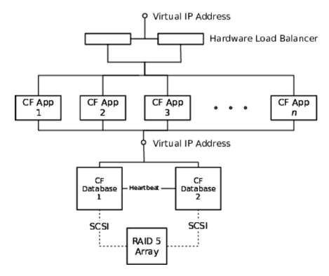
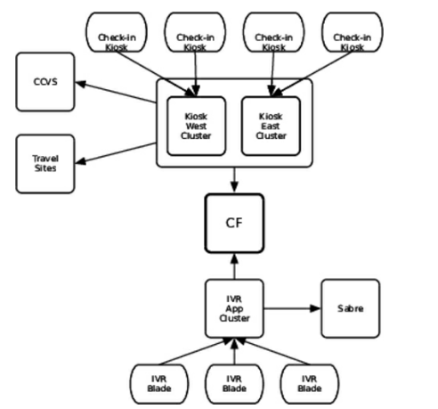
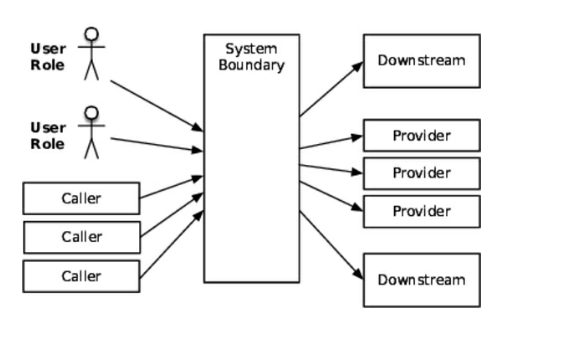
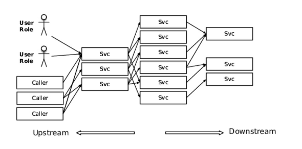
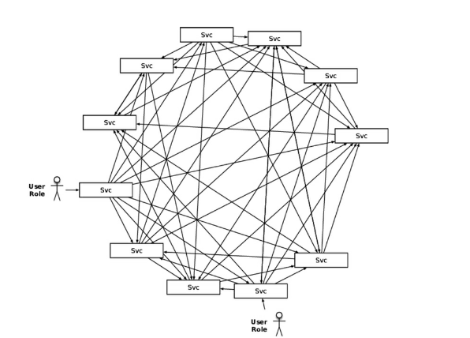

# 序文
この本では、さまざまな現実に向き合ったソフトウェアのアーキテクチャ、デザイン、作り方についてみていく。

## 対象読者
アーキテクト、デザイナー、開発者。

## この本の構成
4つのパートに分かれており、各パートはケーススタディから始まる。
4つのパートとは、

* 安定性について
* 本番環境の設計について
* デプロイについて
* 運用しやすいシステムの構築について

である。

## ケーススタディについて
具体的な社名等は伏せているが、実際に筆者が経験したことについて書いている。

# 1章 本番環境で稼働する
仕様を実装し、直ちに本番環境にデプロイできるわけではない。
また、テストを通したとしても想定外のことが必ず起きる。

## 正しく標準を合わせよ
ローコストで高品質なものを作るべき。？？

## チャレンジのスコープ
ソフトウェアを早く、安く作ったり、操作しやすさを求めたり、などチャレンジすることが多くなるほどアーキテクチャや設計は継続的に改善する必要が出てくる。

## 百万ドルがあちこちに
開発時の工数のみを気にして、運用のことをないがしろにするのはナンセンス。なぜなら、開発は1度きりだが、運用は以後ずっと続くからだ。
本書では、技術的な視点と経営的な視点が大事なものとなってくる。

## フォースを使え
設計によって、その他に与える影響は大きく異なる。本書ではその例を見せていく。

## 現実的なアーキテクチャ
抽象に逃げず、現実を見て設計すべし。

## 要するに
本書では最初のリリースから、それ以降のシステムの拡張について扱う。

# パート1 安定性を作る

# 2章 ケーススタディ：エアラインを止めた例外
小さなエラーが雪だるま式に膨れ上がり、航空会社に大損失を与えた例をあげる。

エラーの発端はcore facilities（CF）に関わるデータベースの計画フェイルオーバーだった。
エラーが発生したとき、この航空会社はSOAへの移行過渡期であり、CFは第一世代のものであった。
構成としては以下の図のようで、単一障害点のない高可用性アーキテクチャであった。



## 窓を変える
計画フェイルオーバーでは、アプリからの接続先DBを1から2に変えて、2につながっている間に、1をアップデートし、それが終わると1に接続を戻し、2も同様にアップデートした。
その時の作業はうまくいき、問題は何も起こらなかった。

## 停止
AM2:30に自動チェックイン機が停止した。数分後にIVRサーバーも停止した。
停止した両システムは、以下の依存関係からわかるように、どちらもCFに依存している。



結局、CFと自動チェックイン機を再起動することで、停止から3時間たって復旧した。

## 結果
たった3時間の停止に見えるがその影響は大きい。

## 死後
障害発生から八時間後のAM10:30に筆者への調査依頼が届く。
障害発生後に解析を行うのは、手掛かりがログや障害時に集めたデータしかなく、難しい。

## 手がかりを探す
これまでの知見をもとにDBのクラスタ構成にバグがないか探すも、バグはなし。
次にアプリケーションサーバのスレッドダンプを見ることにした。
スレッドダンプを読めれば、多くのことが推論できる。

* アプリがどのようなサードパーティライブラリを使用しているか？
* どのような種類のスレッドプールをもっているか？
* 各スレッドプールには何スレッドあるか？
* アプリケーションはどのようなバックグラウンド処理をしているか？
* アプリケーションはどのようなプロトコルを使用しているか？

自動チェックイン機サーバーのスレッドダンプは予想通りのものであった。
各チェックイン機からのリクエストを処理するスレッドが40あるうち、全部がJavaのソケットライブラリの内部のnativeメソッドである、SocketInputStream.socketRead0でブロックされていた。
チェックイン機サーバーの全40スレッドはFlightSearch.lookupByCityというメソッドから呼ばれていることが分かったが、スタック上のそのメソッドの少し上にRMIとEJBのメソッドへの参照があった。

RMIはEJBにおけるリモートでの処理を可能にする。RMIを用いると、マシン間の通信が隠ぺいされるものの、呼び出しのタイムアウトがないため危険である。

## 決定的証拠
残るはCFにおいて何が起こったかを確かめることである。
 
スレッドダンプを調査したところ、全アプリの全スレッドが、リソースプールからコネクションを引っ張ってくるところでブロックされていたことが分かった。
 
状況証拠に過ぎないが、障害前にDBのフェイルオーバーがあったことを考えると、正しい推論のようだ。
 
次に、コードをみようとしたが、障害発生後特有の、誰かに責任を押し付けようという空気感のため、見せてもらえなかった。
 
そのため、本番環境からバイナリを取得し、逆コンパイルしてコードを見たところ、致命的な欠陥を抱えていることが分かった。
それが以下。

```
try  {
  conn = connectionPool.getConnection();
  stmt = conn.createStatement();
   // Do the lookup logic 
   // return a list of results
} finally {
  if  (stmt != null) {
    stmt.close();
  }
  if (conn !=null) {
    conn.close();
  }
}
```

java.sql.Statement.closeメソッドはデータベースのフェイルオーバー後などに実行するとエラーが発生することがある。
 
フェイルオーバー後はTCPの接続が引き継がれず、OSとネットワークドライバがTCPが切断されたと判断したときに、ソケットはIOExceptionをスローする。
 
JDBCのコネクションはTCP切断が切れた後もステートメントを受け入れ続け、ステートメントを実行した際にSQLExceptionがスローされ、Statementのcloseでも例外が発生する。
 
ここでの教訓は、JDBCの使用上、java.sql.Statement.closeはSQLExceptionを投げうるので、適切に扱わねばならないということだ。
 
上記のコードでは、Statementのcloseで例外が起こると、コネクションのcloseはされないので、結果としてブロックされるようになったのだった。
 
大規模障害は一つのSQLExceptionを適切に処理しないことにより起こったと言える。

## ほんの少しの予防？
どうすればこれを予防することができたか？見るべきところが分かれば、テストを実施することは容易である。
 
究極的には、バグを予見しきることは不可能である。
 
最悪なのは、1つのシステムのバグが伝播していくことである。例でみたようなバグの伝播が起きないような設計手法を以後みていく。

# 3章 システムを安定稼働させよ
現実世界で起こることはテストでの予想の範疇を超えてくる。
 
エンタープライズソフトウェアは、エラーは必ず起きるものと前提を置き、他システムとの関係は疎であることを保つようにする。
 
2章の例では、互いに疎な関係を保てていなかった。
 
低い安定性は重大な利益損失につながる。
 
また、安定性は企業の評判にも響いてくる。
 
驚くことに、高度な安定性を保った設計と、そうでない設計の実装にかかるコストはたいてい同じくらいである。

## 安定性を定義する
安定性について話すために、いくつかの用語を定義する。
transactionは、データベースのトランザクションではなく、eコマースにおける購入の一連の流れのようなものを指す。
mixed workloadは、transactionの組み合わせを指す。
 
systemは、ユーザーがtransactionを実行するために必要な諸々を指す。
 
堅牢なsystemは一時的なimpulseや、永続的なstressが特定期間かかっても、transactionを処理し続ける。
 
impulseはsystemに対する急激な刺激のようなものを指す。
対して、stressはsystemに対して特定期間かかり続ける負荷を指す。
 
impulseが原因で起こる問題の例としては、著名人があなたのwebサイトについて言及して、急激にアクセス数が増加するようなことがあげられる。
 
stressが原因で起こる問題の例としては、クレジットカードの決済処理機能を使用し続けて、キャパシティの問題で処理が遅くなるようなことがあげられる。
 
息の長いsystemはtransitionを長時間処理し続ける。長時間の定義としては、コードデプロイの間隔を用いるとよい。（？ぴんと来ない）
 
## 寿命を延ばす
システムの寿命を脅かすものでよくあるのは、メモリリークとデータの増大であり、これらはテストでは気づきにくい。
 
マーフィーの法則によると、テストできない事柄は必ず起こると考えたほうが良い。
 
困ったことに、本番環境で稼働させる以上の時間をかけて、開発環境でアプリケーションを稼働させることは普通できない。
 
この種のバグは負荷テストでも検知することはできない。なぜなら、負荷テストではそんなに長期ではない一定の期間しか負荷をかけ続けないからだ。
 
どのようにすればこの種のバグを発見できるだろうか？
常にリクエストを送り続けるようなテストを実施すれば発見できる。（JMeter等つかってリクエストを送り続ける）
 
経済的な理由で完璧な環境が得られずとも、コアな機能では上記のようなテストを実施したほうが良い。
 
それもダメならぶっつけ本番になってしまうが、平穏に過ごしたいなら、ちゃんと本番前にテストしたほうがいい。


## 故障モード
バグのトリガー、システムの残りの部分への広がり方、その結果、全部ひっくるめて故障モードという。
 
故障の内容を検知すれば、影響をシステム内にとどめておけるような安全な故障モードを設計できる。
 
故障モードを定義しておかないと、急に予期せぬ事象に対応する羽目になる。
 
## 亀裂の伝播を止める
2章の例でどのように故障モードを設計していくか見ていく。
この例では、SQLExceptionの不適切なハンドリングが問題源であったが、広がりを防ぐ方法はいくつかあった。
それらを様々なレイヤの観点からみていく。
 
コネクションプールに余りがない場合にはリクエストしてきたスレッドをブロックする設定になっていたが、新しいコネクションを作成したり、一定時間だけブロックする設定にしていれば故障の広がりは防げた。
 
CFはRMIで呼ばれるEJBを用意していたが、RMIの呼び出しはデフォルトではタイムアウトすることがない。
つまり、呼び出し元は、最初の20の呼び出しでSQLExceptionをラップした例外を受け取った後、ブロッキングが始まったということである。
 
RMIのソケットにタイムアウトを設定したり、そもそもEJBではなく、HTTPベースでの連携にしてタイムアウト設定をしておけば、CF外に障害が広がることはなかった。
 
より大きなスケールでの対策として、CFサーバを別のサービスグループに区分けしておく方法がある。これによって問題を1つのサービスグループ内に閉じ込めておくことができる。（今回の例では全サービスグループで同じ問題が起きるが）
**サービスグループってなんだ？**
 
さらに大きなアーキテクチャ上の話をすると、CFとのやりとりはメッセージキューを使うこともできた。
これにより、システム同士の結合を疎に保つことができ、障害の伝播を抑えることができる。
 
## 故障の連鎖
全てのシステム停止には上記で見たような故障の連鎖がある。
個々の事象を切り取ってみると、とても起こりそうにないように見えるが、これらは密接に関連しているので、他の故障に合わせて自身の故障確立も上がってしまう。
 
イベントの連鎖について、用語を簡単にまとめる。

* Fault（障害）：ソフトウェア内に不正な状況を作り出してしまう状態
* Error（エラー）：目に見えて不正な挙動をする状態
* Failure（故障）：システムが反応しない状態

 
FaultがErrorとなり、ErrorがFailureを引き起こす。このようにしてダメージが広がっていく。
 
複雑なシステムには様々なダメージの広がり方や、エラーとなるきっかけがある。
 
また、蜜結合したシステムはダメージの広がり障害を加速させる。
 
起きうる故障に備える一つの方法としては、全てのメソッド呼び出し、I/O、リソース使用、呼び出し予想結果をみていき、これらがうまくいかなかった場合にどうなるか自問自答し、様々なimpulse、stressについても考慮する方法がある。
 
上記のことはほんの一部であり、ブルートフォース的なアプローチですべてを洗い出すことは非現実的である。
 
障害の扱いに関しては、コミュニティの中でも2つの陣営がある。
1つはフォールトトレランスなシステムにすべきという陣営で、もう1つはフォールトトレランスにしても無意味であるという陣営である。
 
しかし、両陣営でも合意していることが2つある。

* Faultは起きるということ
* FaultをErrorにしてはならないということ

## 締めくくり
故障にはパターンがあるので、それを4章で紹介する。
 
5章ではアンチパターンを克服するための設計・アーキテクチャのパターンを紹介する。
そこでは障害のきっかけを防ぐ方法ではなく、ダメージを一部にとどめておく方法の説明を行う。


# 4章 安定性アンチパターン
本章ではシステムを止めてしまうアンチパターンを見ていき、事象でアンチパターンへの対抗策を見ていく。
 
## インテグレーションポイント
現代のウェブサイトはHTML、フロントエンドアプリ、APIなどを結合させたものとなっており、その形式はバタフライ型と蜘蛛の巣型に二分される。
バタフライ型はたくさんのコネクション、フィードを持つ中央システムが仲介する。
このようなシステムをモノリスと呼ぶ。



 
もう一方は蜘蛛の巣のようなスタイルをとる。
サービスをティアで分けると次の1つ目のような構造になるが、わけない場合は2つ目のようなカオスな構造になる。






バタフライ型は2Nのコネクションがあり、蜘蛛の巣型は最大で2のN乗のコネクションがあり得る。
全てのコネクションがインテグレーションポイントであり、システムを脅かす。
 
インテグレーションポイントはシステムにとってNo.1キラーである。
これ以降はインテグレーションポイントがどのように悪さをするかと、どのように対処すればよいかを見ていく。

### ソケットベースプロトコル
高レイヤにおいては名前付きパイプ、共有メモリIPCを除けばだいたいのインテグレーションプロトコルはソケットの仕組みを利用している。
 
最もシンプルな故障モードはリモートシステムがコネクションを拒絶した場合であり、これは扱いがしやすい。
 
ただし、1つ気をつけねばならないのは、接続ができないとわかるまでに長時間かかる場合だ。

ソケットがブロックをし続けないようにタイムアウトの設定をしておく必要がある。
 
ネットワーク故障には2種あり、1つは早く反応が返ってくるもので、もう1つは反応がなかなか返ってこないものだ。
反応が返ってこないものは、場合によってはサーバをダウンさせてしまう。

### 午前5時の問題
毎朝5時に障害が起こるサイトがあった。
そのサイトは30のサーバインスタンスで運営されており、5分間の間で全インスタンスがハングしていた。
再起動によって常にその問題は解決されていたので、朝5時に何かが起こったと言える。
 
リリース後3日目に障害が起こり、スレッドダンプをみると、スレッドはオラクルのJDBCライブラリのOCIコールでブロックされていた。
ブロックされていたスレッドを殺し、再度DBとの同期を図ると、低レイヤでのread、writeがおこっているように見えた。
 
次に、tcpdumpとWiresharkを使った。
不思議なことに、アプリケーションサーバからパケットを送っているのに、データベースからの返答がなかった。（DBの状態は正常）
 
同じ障害が翌朝にも起きた。
その時、ファイアウォールよりDB側にはパケットがなにも流れていなかったことから仮説を立てた。
アプリケーションサーバのリソースプールのクラスをデコンパイルしたところ、立てた仮設に確信をもった。
 
TCPのコネクションはエンドポイントのメモリにその情報があれば、1つもパケットのやり取りがなくとも数日間コネクションを保てる。
 
ファイヤーウォール内で持っているコネクションの定義は時間制限があり、最後に通過したパケットからあまりに時間が経過していると、通信は切れているものと判断され、パケットをignoreすることになってしまう。
 
ファイヤーウォールからICMPのresetを投げて、そのルートが機能していないことを伝える方法もあるが、それは悪意を持った者にネットワークの情報を与えることにつながるので、行っていなかった。
 
リソースプールをデコンパイルしたところ、FIFOのアルゴリズムでリソースの出し入れが行われていた。
つまり、アクセス頻度の少ない深夜は、スタック最上部のリソースを使いまわし、残りの39リソースはファイアウォール上でタイムアウトとなる時間以上アイドルとなっていたのだった。
 
午前5時となり、トラフィックが増した後、39個のコネクションはすぐにロックされ、残った一つも遅かれ早かれブロックされたスレッドから呼ばれて、全体がハングすることとなった。
**残りの1個のブロックの部分が止まる仕組みがよくわかってない**
 
解決策としては、古くなったコネクションを閉じる、死神のようなスレッドを用意することを考えた。
それに関しては、Oracleのdead connection detectorを使用することになった。
 
dead connection detectorではDB側からパケットをアプリケーションサーバに送るので、コネクションが生き続けることにもつながった。
 
ここでの教訓は、問題を解決するにあたっては、レイヤを掘り下げていくことも必要になるということだ。
 
次はHTTPベースのプロトコルで起こった問題についてみていく。

### HTTPプロトコル
今日のサービスではHTTP上でjsonを使用したREST通信が主なものとなっている。
 
HTTPベースの通信では、上記で説明してきた内容に加えて、独自の問題があり得る。

* プロバイダがTCPコネクションは受け付けるけど、HTTPリクエストは返してこないかもしれない。
* プロバイダがコネクションは受け入れるが、リクエストを読み込まないかもしれない。リクエストが大きいと、TCPバッファがフルになり、ソケットをブロックしてしまうかもしれない。
* プロバイダがどのように扱えばよいかわからないレスポンスステータスを返してくるかもしれない。
* プロバイダがどのように扱えばよいかわからないcontent-typeを返してくるかもしれない。
* プロバイダがJSONでレスポンスを返すと宣言していても、実際はplain textで返されるかもしれない。

クライアントライブラリとしては、タイムアウト制御を細かく行えて、レスポンスのハンドリングができるものを使うべき。

### ベンダーAPIライブラリ
ソフトウェアベンダが提供するクライアントAPIライブラリは問題を抱えていることが多い。
 
これらのライブラリを使うにあたって嫌なことは、これらに対してコントロールがあまり効かないことだ。
ソースコードがついていない場合はデコンパイルして問題を探さなければならない。
 
ベンダAPIで最も安定性を殺しにかかってくるのは、ブロッキングについての面である。
 
以降、クライアントAPIライブラリにおけるデッドロックの具体例が載っていたが割愛。
 
### インテグレーションポイント問題に対抗するには
インテグレーションポイントの安定性を保つ最も有効な方法は、サーキットブレーカーとデカップリングミドルウェアである。
 
テストハーネスを用いたインテグレーションテストも対策として役に立つ。
 
安定性を確かめるにおいては、システムに高負荷がかかっている状態でテストを実施する必要もある。
 
### 覚えておくこと

* 必要悪に注意
  * 全てのインテグレーションポイントは何らかの形で失敗するので、その故障に備えなければならない。
* 様々な故障に備える
  * 綺麗なエラーレスポンスが返ってくることは期待せず、プロトコル規約違反、遅いレスポンス、ハング等に備える。
* いつ抽象を切り開くかを知る
  * インテグレーションポイントの故障のデバッグをするにおいては、レイヤ分けによる抽象を具体的に見ていかないといけないことがある。
* 故障はすぐに広がる
  * ちゃんと防御されていなければ、リモートシステムでの故障はすぐに自分の問題になる。
* インテグレーションポイントにまつわる問題を遠ざけるために、パターンを適用する
  * サーキットブレーカー、タイムアウト、デカップリングミドルウェア、ハンドシェークといった手法により、インテグレーションポイントの危険を避けることができる。

## 連鎖反応
現在主流のアーキテクチャは水平スケールする。
 
水平スケールをするなら、ロードバランサー等をおいて、冗長性によるフォールトトレランスを実現できる。
 
水平クラスタリングされた構成では、単一障害点がないものの、かかってくる負荷に関わる故障モードがありうる。  
例えば、8つのサーバで負荷分散をしているとして、1つのサーバが落ちた場合に、それ以降1つのサーバにかかる負荷はそれまでより15%程度増える。  
仮に最初のサーバが高負荷が原因で落ちているのだとすると、他のサーバがいずれ落ちるのは自明である。
 
連鎖反応を防ぐには、バルクヘッドパターンが有効となることもある。
 
連鎖反応がシステムに及ぼす影響の1つとしては、あるレイヤで故障が起きたとしたら、それを呼び出しているレイヤでも故障を引き起こすといったことがあげられる。
 
連鎖反応は、ブロックされたスレッドにより引き起こされることがある。  
1つのサーバーのアプリケーションのスレッドがすべてブロックされた場合、本来入ってくるはずだったリクエストは他のサーバにまわされる。それにより、他のサーバでも同様のブロックが起こりやすくなる。

### 覚えておくこと

* 1つのサーバのダウンが残りの存続を危うくさせると認識すること
  * 1つのサーバがダウンすると他のサーバにしわ寄せが行き、他のサーバがダウンしやすくなり、連鎖反応で全体がダウンしてしまう。そこに依存しているレイヤも追ってダウンしてしまう。
* リソースリークを追う
  * 大概の場合、連鎖反応が起こるのは、アプリケーションのメモリリークがある場合である。
* あいまいなタイミングのバグを追う
  * トラフィックによって、あいまいな競合状態が引き起こされることがある。1つのサーバがデッドロック状態になると、他のサーバへの負荷が高まり、そこでもデッドロックが起きやすくなる。
* オートスケーリングを使う
  * クラウド環境においては、すべてのオートスケーリンググループに対してヘルスチェックをしておくべき。ヘルスチェックが失敗するインスタンスは即座にシャットダウンし、再作成することで、連鎖反応を止められる。
* バルクヘッドで防御する
  * サーバーをバルクヘッドで分けることによって、サービス全体が停止することを避けられるかもしれない。


## カスケード故障
カスケード故障は、あるレイヤーでのクラックが、呼び出し側レイヤのクラックのトリガーとなるときに起こる。
 
一例としては、データベースが故障したとき、呼び出しているアプリケーションの作りが悪い場合、アプリケーションも故障してしまうといったようなものだ。
 
昔は3層構造アーキテクチャであったが、今は何千ものサービスがリンクして、それぞれがDBを持っている。
そのすべてのリンクがカスケード故障を起こしうる。
 
多数から呼ばれているサービスは、問題が起きた場合に大きな広がってしまうので、十分に検討して作るだけの価値がある。
 
カスケード故障は、呼び出し側に悪いところがあったとき、依存先の故障がトリガーとなって引き起こされる。
 
カスケード故障は、低レイヤの故障によりリソースプールが枯渇し、その結果引き起こされることが多い。  
タイムアウト設定をしていないインテグレーションポイントは確実にカスケード故障を引き起こす。
 
故障がレイヤを超えるメカニズムは、主にブロックされたスレッドによるものが多いが、逆に下層を過剰に呼び出して問題になってしまう場合もある。  
例えば、下層で再現性のない原因不明のエラーがよく出る場合で、エラーが出てきた場合にはリトライすると判断したとする。  
もし、リトライしても構わないエラーと、重大なエラーが見分けられない場合には、重大なエラーが発生したときに下層を呼び出し続けてしまう。
 
インテグレーションポイントがクラックのNo1発生源だとすると、カスケード故障はNo1クラック加速器であるといえる。  
カスケード故障の対策として有効なのは、サーキットブレーカーとタイムアウトがあげられる。


### 覚えておくこと

* クラックがギャップを超えるのを止める
  * カスケード故障はクラックが1つのシステムから他のシステムのレイヤに飛び火すると起こるが、これはたいていインテグレーションポイントに問題があるためだ。また、カスケード故障は下層のレイヤが故障した後の連鎖反応としても起こりうる。
* リソースプールを精査する
  * カスケード故障はしばしばリソースプールが枯渇していることによって引き起こされる。安全なリソースプールとするために、リソースの取得に時間制限を設けておく。
* タイムアウトとサーキットブレーカーで防御する
  * カスケード故障は、何か他の問題が起きた後に起こる。サーキットブレーカーを用いることで、トラブルが起きたインテグレーションポイントを呼ぶことを避ける。また、タイムアウトを設定しておくことで、トラブルのあったインテグレーションポイントへの呼び出しをキャンセルする。

## ユーザー
ユーザーのためにシステムは存在するものの、ユーザーの存在はシステムの安定性への大きなリスクとなる。

### トラフィック
トラフィック増量への対処方法を考えねばならない。
 
負荷がかかった状態で、決められたパフォーマンスを出す必用がある。また、内部的にはそれ以上に厳しい制限がある。  
これらの制限をクリアする際に、クラックを生んでしまうことがある。
 
クラウド環境下であれば、オートスケーリングできるが、バグのあるアプリケーションにより、巨額の請求をされることはよくあることなので気を付けること。

### ヒープメモリ
厳しい制限の1つにメモリ使用可能量がある。  
一番よく問題となるのが、バックエンドにおけるセッションの保持だ。  
セッションは最後のリクエストから一定時間以上メモリに居座る。
 
メモリ不足になると、様々な驚くべき反応が起こる。  
一番ましなのはOOMが起こることだが、たちの悪い場合だと、メモリ不足が原因でログへの書き込みができなくなる。
 
メモリ内でセッションが占める領域は最小限にしておくべきだ。  
ページングの実装であれば、検索全取得結果をメモリに保持するのではなく、新しいページに飛ぶたびにクエリを発行するほうが良い。
 
メモリが潤沢な場合はセッションを保持し、メモリがタイトな場合は破棄したい、といった場合には弱い参照を使えばよい。
 
コストの高いオブジェクトをpayloadとして、弱い参照で作ってやる。具体的には以下のようになる。

```java
MagicBean hugeExpensiveResult = ...;

SoftReference ref = new SoftReference(hugeExpensiveResult);

session.setAttribute(EXPENSIVE_BEAN_HOLDER, ref);
```
 
これは透過的な変更ではなく、この部品にアクセスするものは、弱い参照が使用されていることを知っておかねばならない。
 
ガベージコレクターはいつでもpayloadを刈り取りうるので、呼び出し元はそれに備えた作りにしておかねばならない。
 
弱い参照は変わりゆくメモリ状況に対応するのに有効であるが、複雑さを生んでしまう。  
できるなら、セッションから情報を追い出してしまうほうがよい。

### オフヒープメモリ、オフホストメモリ
その他の良い方法として、ヒープ内に情報を保つのではなく、インメモリKVSのMemcachedを使用して他のマシンに情報を追い出す方法がある。
 
Redisもまた、キャッシュとDBの中間的な存在として有名である。
 
こういったアプローチは許容メモリサイズとアクセスレイテンシのトレードオフであり、これといった正解はない。
 
### ソケット
TCPの仕組み上、1つのマシンで開ける最大のポート数は64511である。
 
しかし、それ以上の数の接続を受け入れているサーバはある。
 
それらは仮想IPアドレスを使用し、1つのネットワークインターフェースに対し、複数のIPを結びつけることで実現している。
 
この対応は簡単ではない。  
OSがTCPをどのようにチューニングしているかを学ぶ必要がある。

### 閉じたソケット

