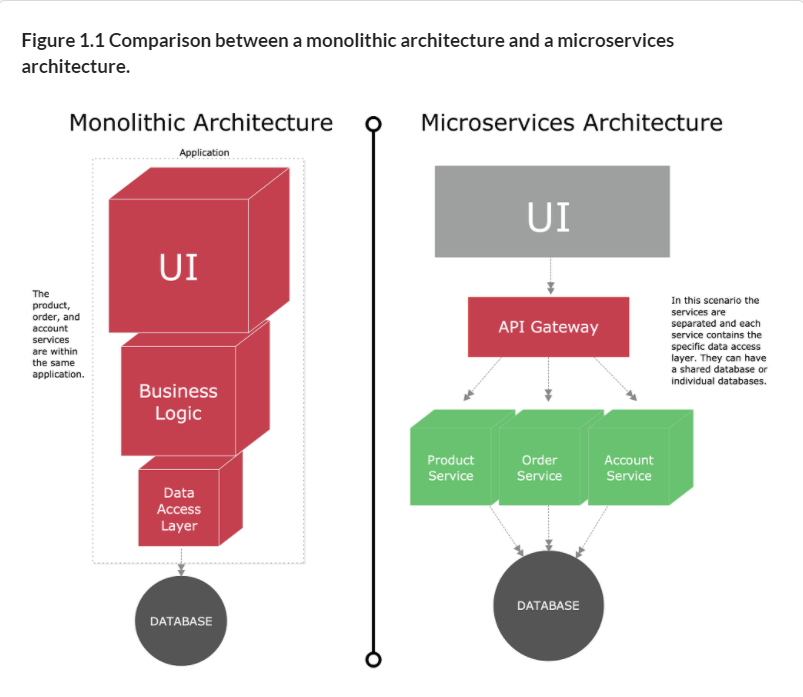

# 1. Welcome to the cloud, Spring

マイクロサービスは気にすべき点がいっぱいある。
この本を読んだら、スケーラビリティ、サービスディスカバリ、モニタリング、分散トレーシング、セキュリティ、マネジメント等をできるようになる。

## 1.1 The evolution towards a microservices architecture

モノリシックとマイクロサービスの比較。

この本での定義。

* モノリス。モノリスとは、その言葉通り、すべてが1つのピースで構成されていることです。本書では、モノリスアプリケーションとは、すべてのコンポーネントが同じアプリケーションに含まれているバックエンドのことを指します。これは、そのすべてのコンポーネントが相互に接続されていることを意味し、各サービスが提供している機能性の種類については、一切の区別がありません。
* Microservice Architecture。1つのアプリケーションを、疎結合で保守性の高い独立した複数のサービスに分割し、それらが連携して完全なソフトウェア製品を提供するアーキテクチャスタイル。このアーキテクチャの主な目的は、ビジネス目標や機能性を考慮してサービスを分離することです。
* クラウド。クラウドとは、インターネットのことを指します。つまり、クラウドとは、私たちが開発したすべてのサービスをインターネット上で利用できるようにすることを意味します。
* デプロイメント。デプロイメントとは、アプリケーションを本番サーバーで実行するプロセスのことです。このプロセスでは、アプリケーションを使用できるようにするためのすべての活動を強調することができます。

### 1.1.1 What's a monolithic architecture?

１つのアプリに対して、多くのチームが関わっている。

### 1.1.2 What's a microservice?

マイクロサービスアーキテクチャの特徴
* アプリケーションロジックは、責任の境界が明確に定義された、粒度の小さいコンポーネントに分解され、それらが連携してソリューションを提供します。
* 各コンポーネントは責任のある小さな領域を持ち、互いに完全に独立してデプロイされます。マイクロサービスは、ビジネスドメインの単一の部分に責任を持つ必要があります。
* マイクロサービスは、いくつかの基本原則に基づいて通信し、サービスコンシューマとサービスプロバイダの間でデータを交換するために、HTTPやJSON（JavaScript Object Notation）などの軽量な通信プロトコルを採用しています。
* アプリケーションは常に技術的に中立なフォーマット（JSONが最も一般的）で通信するため、サービスの基本的な技術的実装は関係ありません。つまり、マイクロサービス・アプローチを用いて構築されたアプリケーションは、複数の言語や技術を用いて構築することができるのです。
* マイクロサービスは、その小規模で独立した分散型の性質から、組織は責任範囲が明確に定義された小規模な開発チームを持つことができます。これらのチームは、アプリケーションの提供など、一つの目標に向かって仕事をしますが、各チームは自分たちが作業しているサービスに対してのみ責任を負います。

### 1.1.3 Why change the way we build applications?

グローバル競争になるにつれて、開発者の考え方も変わってきた。

* 複雑さは格段に増しています。お客様は、組織のすべての部分が自分のことを知っていることを期待しています。"単一のデータベースに接続し、他のアプリケーションと統合しない「サイロ化」されたアプリケーションは、もはや標準ではありません。今日のアプリケーションは、企業のデータセンター内だけでなく、インターネットを介して外部のサービスプロバイダーに存在する複数のサービスやデータベースと通信する必要があります。
* お客様は、より迅速な納品を求めています。お客様はもはや、ソフトウェアパッケージの次の年次リリースやバージョンを待つことを望んでいません。代わりに、ソフトウェア製品の機能がアンバンドルされ、新しい機能が数週間（数日）で迅速にリリースされることを期待しています。
* パフォーマンスとスケーラビリティ。グローバルなアプリケーションでは、アプリケーションで処理されるトランザクション量と、そのトランザクション量がいつ発生するかを予測することは非常に困難です。アプリケーションは、複数のサーバに迅速にスケールアップし、必要なボリュームがなくなったらスケールダウンする必要があります。
* お客様は、アプリケーションが利用可能であることを期待しています。お客様は、ワンクリックで競合他社を見つけることができるため、企業のアプリケーションは高い回復力を備えていなければなりません。アプリケーションの一部分で障害や問題が発生しても、アプリケーション全体がダウンすることはありません。

期待にこたえるために、開発者は以下のようなことを考える。

* フレキシブル。デカップリングされたサービスは、新しい機能を迅速に提供するために構成したり、再配置することができます。扱うコードの単位が小さければ小さいほど、コードの変更が容易になり、テストデプロイにかかる時間も短縮されます。
* レジリエント。分離されたサービスは、アプリケーションの一部分が劣化するとアプリケーション全体が失敗するような、単一の「泥の塊」ではなくなります。障害はアプリケーションのごく一部に限定され、アプリケーション全体が停止する前に食い止めることができます。また、回復不能なエラーが発生した場合にも、アプリケーションを優雅にデグレードすることができます。
* スケーラブル。デカップリングされたサービスは、複数のサーバーに容易に水平分散できるため、機能やサービスを適切に拡張することができます。アプリケーションのすべてのロジックが絡み合っているモノリシックなアプリケーションでは、アプリケーションの一部だけがボトルネックになっていても、アプリケーション全体をスケールアップする必要があります。小規模なサービスでのスケーリングは局所的であり、はるかにコスト効率が高い。

1.2 Microservices with Spring
